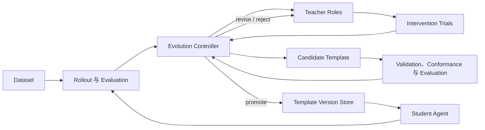

# 系统上下文

Search Harness 用 Teacher 模型分析 Student Agent 的失败，验证局部干预，并把有证据支持的机制编译为新的 Harness Template 候选。系统优化的是 Student 的外部运行机制，不把模型权重训练纳入当前边界。

## 核心对象

- **Agent**：一个 Harness 与一个 Model 的组合。
- **Harness**：除模型调用外，驱动 Agent Run 所需的外部状态管理与行为机制。
- **Harness Template**：用于实例化 Harness 的可移植目录资产，包含 Manifest 和 Component。
- **Agent Run**：一次输入到终态的执行；其过程记录为 Trajectory。
- **Evaluation Run**：对一组 Rollout 的判分与聚合。
- **Evolution Run**：从一个 Accepted Template Version 出发，跨一个或多个 Generation 推进的可恢复实验运行。
- **Template Version Store**：保存 Accepted Template Version，并记录 Candidate Attempt 的事件。

完整定义与允许的简称见[项目语境](../../CONTEXT.md)。

## 系统边界

外部依赖包括数据集文件、Student/Teacher API、检索后端和本机 Git。项目负责把这些依赖的配置、输出与错误转换为可审计的运行产物，不负责供应外部服务。

## 两条主要运行路径

普通运行路径装配一个模板，创建 `Agent`，再由通用 `LoopRunner` 驱动生命周期。它不区分 Student 或 Teacher；角色差异来自模板、模型与上层 Runner。

进化路径由 Controller 维护 agenda。每个 `WorkItem` 要么调用一个 Teacher Role，要么执行确定性的评估、候选管理或晋升操作。结果先持久化，再由 transition 规则决定下一项工作，因此可在中断后恢复，且无需把完整流程写成单个固定函数。

## 持久化边界

- 单次运行可输出完整 trace JSON。
- 数据集 Rollout 使用 JSONL，一行对应一个 replicate。
- Evaluation 生成摘要与逐例、逐 Rollout 结果。
- Evolution Run 使用 `run.json` 固定配置、`events.jsonl` 记录控制事件、`artifacts/` 保存较大工作产物。
- Version Store 用 Git 保存已接受模板，用 JSONL 保存版本和 Candidate Attempt 事件。

具体格式见[产物 Schema](../reference/artifact-schemas.md)。
