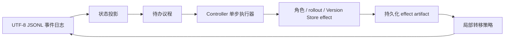
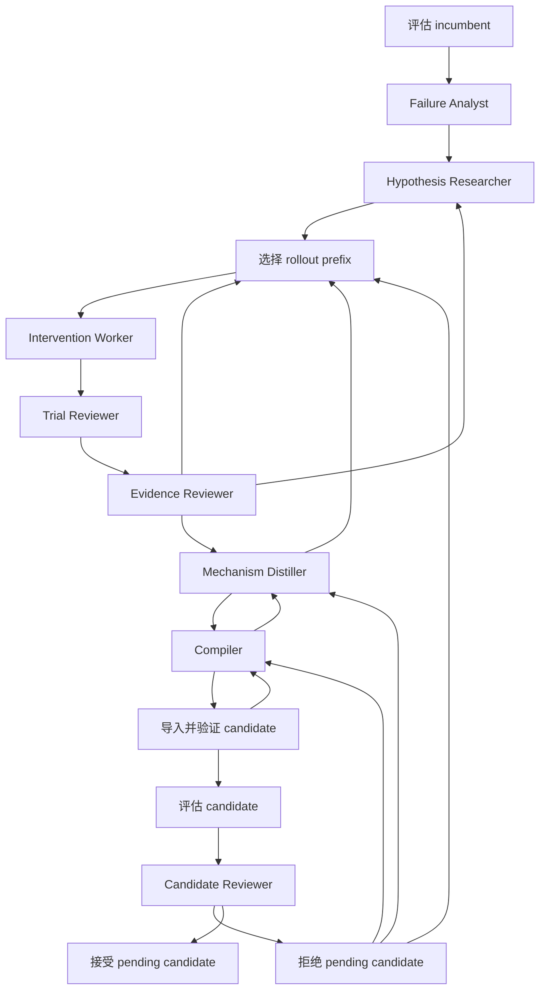

# Evolution Controller v2 设计

## 目标

正式闭环需要把八个 Teacher 角色、Actor 评估和 Version Store 串成可恢复的
进化过程，同时避免把角色顺序固化为一条难以修改的长 workflow。

本设计采用“事件日志 + 待办议程 + 局部转移”：

- Controller 只执行一个很小的循环：回放状态、选择一个 `WorkItem`、执行
  effect、记录结果、应用局部转移；
- 每个角色只提交职责范围内的语义判断，不返回 `next_role`，也不能直接接受
  Harness 版本或终止整个 run；
- 路由由确定性策略根据角色结果、预算和门禁决定；
- 大型轨迹、角色 transcript、评估报告和候选文件保存在 artifact 中，事件日志
  只保存状态变化和 artifact 引用。

## 架构

Controller 当前是单进程、单写入者和单候选。角色执行、rollout 并发和 judge
并发仍由各自 runtime 负责。当前没有引入通用 DAG 引擎、并行候选 portfolio、
跨 run Experience Store 或分布式锁；这些能力没有被当前闭环验证所要求。

## 稳定控制对象

### `WorkItem`

| 字段 | 职责 |
| --- | --- |
| `work_id` | 当前待办的稳定幂等标识。 |
| `kind` | 要执行的角色调用或确定性 effect 类型。 |
| `subject_ref` | 当前代和研究主题的紧凑标识，不承载大型上下文。 |
| `input_refs` | 上游持久化 artifact 的命名引用。 |
| `payload` | 当前局部路由所需的预算计数、义务和确定性摘要。 |
| `parent_work_id` | 产生当前待办的直接父待办。 |
| `attempt` | 当前待办的执行次数，用于局部重试预算。 |

`WorkItem` 创建后不可修改。修订、继续取证和重试都创建新待办，因此不会覆盖
历史输入。

### `EffectResult`

| 字段 | 职责 |
| --- | --- |
| `outcome` | 当前 effect 的小型结构化结果。 |
| `artifact_refs` | 完整角色 artifact、报告、trial 或收据的路径引用。 |
| `usage` | 本 effect 的确定性资源统计，当前至少记录 `total_tokens`。 |

### 事件

事件分为 run 生命周期、版本推进和 WorkItem 生命周期三类：

- `run_started`、`run_resumed`、`run_paused`、`run_completed`；
- `version_advanced`；
- `work_scheduled`、`work_started`、`work_completed`、`work_failed`、
  `work_transitioned`。

`work_completed` 表示 effect 已经完整落盘；`work_transitioned` 表示该结果已被
路由。两者分离后，Controller 可在任意一侧中断并通过事件回放继续。

## 局部转移

主路径不是一个可编程 workflow 脚本，而是每类工作各自拥有的小型转移：

图中的回边都有显式预算。具体语义如下：

- Worker 的 `unsuitable_assignment` 只重新选择 prefix；
- Worker 的 `unsupported_hypothesis` 返回同一个 Researcher session；
- Evidence Reviewer 的 `continue` 保持假设并追加 trial；新 trial 先由独立
  Trial Reviewer 审阅，再与已有局部审阅一起重新总评。`revise` 或 `reject`
  返回同一个 Researcher session，`ready_to_distill` 才进入 Distiller；
- Distiller 的 `needs_evidence` 返回 trial 议程，`not_distillable` 结束本代研究；
- Compiler 的 `needs_revision` 返回机制层；Version Store 校验失败返回 Compiler；
- Candidate Reviewer 的 `revise` 必须用 `revision_target` 明确返回
  `evidence`、`mechanism` 或 `implementation` 层；`next_obligation`
  分别进入下一次试验义务、机制能力约束或实现约束，不能只改变路由而丢失
  修订原因；
- Candidate Reviewer 的 `accept` 只是建议，最终还要通过确定性 promotion gate。

## 确定性边界

Controller 负责：

- 先尝试 Analyst 引用，再按冻结评估文件顺序选择未使用且 phase 匹配的
  rollout prefix；Worker 负责拒绝语义上不适合的 assignment；
- 维护 trial、assignment、修订、重试、工作总数和 token 预算；
- 根据 Compiler `changed_files` 创建 Version Store pending iteration；
- 重新执行 Version Store validation；
- 运行 incumbent/candidate 同一 Experience Set 评估；
- 结合 Reviewer 建议、准确率变化和 token 比例决定 promotion；
- 接受或拒绝 pending iteration，并记录新版本。

Teacher 角色负责局部语义判断。`InterventionHypothesis.trigger_phase` 是明确的
可恢复 phase；`CandidateReview.revision_target` 是明确的修订层。Controller
不从自然语言中猜测这两个路由信息。

## 恢复与幂等

effect 先原子写入 `artifacts/<work_id>/effect.json`，再追加
`work_completed`。恢复时：

1. 若 running 工作已有 effect 文件，补记 `work_completed`，不重复调用模型；
2. 若没有 effect 文件，记为中断失败并只重试该 WorkItem；
3. 已完成但未转移的工作重新应用确定性转移；
4. staging 以 parent version 和 Compiler candidate digest 查找已有 iteration，
   避免重试留下重复 pending candidate；
5. promotion 以 iteration ID 查找已接受版本，避免重复 Git commit。

当前事件日志假设一个 Controller 写入者。引入并发 Controller 前必须先增加明确的
写入所有权或锁协议，不能依赖现有实现偶然工作。

## 暂不实现

- 多候选并行搜索和 portfolio 选择；
- 通用 workflow DSL 或任意 DAG；
- 跨 run Experience Store；
- 自动上下文压缩；
- 分布式调度和并发日志写入。

这些能力只有在实验提出明确需求后才应增加。
