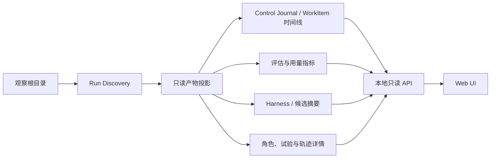

# Evolution Experiment Observer 方案

## 1. 目的与范围

本方案定义一个独立的本地网页服务，用于只读观察指定目录下的 Evolution Run。它帮助研究者
浏览控制过程、Teacher Role 产物、Student Trajectory、Harness 版本和评估指标；不参与
Evolution Controller 的路由、恢复、写入或 Promotion。

首版观察对象是直接位于用户指定根目录下、且包含 `run.json` 的子目录。实验显示名使用目录名，
同时显示目录创建或修改时间。无法解析的目录仍显示为实验条目，并给出简短错误原因。

本方案不改变当前 `search_harness` 的运行产物 Schema，也不要求重跑既有实验。

观察器以新的顶层独立软件包实现，不使用、继承或依赖现有 `search_harness.visualizer`。后者是
历史 Trace Viewer，不满足本方案的 Evolution Run 语义和“不执行 Harness”的只读边界。具体模块与
实施次序见[实施计划](experiment-observer-implementation-plan.md)。

### 1.1 非目标

- 不修改、删除、恢复或重试任何 Evolution Run、Candidate Attempt 或 Template Version。
- 不调用 Student、Teacher 或 Teacher Judge Model。
- 不重建历史 Candidate Template 的完整文件树；只展示可用的候选摘要、文件变更、diff、
  validation 和评估结果。
- 不在首版把服务暴露到局域网或互联网。

## 2. 术语与事实来源

术语沿用项目的 [CONTEXT.md](../../CONTEXT.md)：Evolution Run、Control Journal、Control
Event、Work Item、Artifact、Evaluation Report、Candidate Attempt 和 Accepted Template
Version 均不在本方案中重新定义。

观察器将下列来源分开处理，不能把派生视图误当作新的事实源：

| 来源 | 权威内容 | 观察器用途 |
| --- | --- | --- |
| `run.json` | Run 身份、冻结配置、初始版本及引用路径 | 实验元数据、外部只读路径定位 |
| `events.jsonl` | Control Journal | Work Item 生命周期、Run 状态、时间线和流程高亮 |
| `artifacts/` | Control Effect 与角色的大型持久化内容 | 详情页、摘要、证据和用量 |
| Evaluation Report/rollout JSONL | 指标和 Student Rollout | 指标曲线、评估详情与 Trajectory |
| Template Version Store | Accepted Template Version、Candidate Attempt Journal、Git 历史 | 最终 accepted Harness 与候选摘要 |

观察器产生的 WorkItem 卡片、阶段耗时、流程节点状态和用量汇总均为派生数据，页面应标注其
来源为 `Journal`、`Artifact`、`Evaluation Report` 或“观察器推导”。

## 3. 访问与运行边界

服务默认只监听 `127.0.0.1`。它可以只读解析 `run.json` 中声明的本地引用路径，例如
Template Version Store；不提供 `0.0.0.0` 监听、认证、写接口或操作性按钮。

服务不在实验目录写索引或缓存文件。Run 索引、Journal 投影和页面缓存只保存在服务进程内存中。
服务重启后可从原始产物重新构建视图。

对路径解析应采用显式允许列表：Run 目录本身，以及由 `run.json` 明确声明、且确实存在的本地
Template Version Store。无法读取、缺失或不在允许范围内的引用应显示为“不可用”，而不是静默
读取任意本地文件。

## 4. 总体结构

建议将软件包独立于 `search_harness` 核心包。它可以复用公开 Schema 或读取逻辑，但不得让核心
Controller 依赖观察器，也不得为了展示目的改变产物写入语义。

### 4.1 后端通用组件

| 组件 | 职责 |
| --- | --- |
| `RunDiscovery` | 枚举根目录的直接子目录，识别有效、运行中和不可读取的 Run。 |
| `JournalProjector` | 从 Control Journal 重建 Work Item、父子关系、重试、状态和 Run 状态。 |
| `ArtifactResolver` | 在允许范围内解析 Artifact Reference，并报告缺失、半写入和格式错误。 |
| `WorkTimelineProjector` | 将同一 Work Item 的多个 Control Event 聚合成业务可读的进展项。 |
| `MetricProjector` | 从 Evaluation Report 构造可比较的评估快照及指标序列。 |
| `UsageProjector` | 依据明确来源聚合 token、调用次数和缓存字段，不估算缺失值。 |
| `HarnessInspector` | 展示最终 Accepted Template Version，并提取候选摘要和静态 Hook 注册推断。 |
| `DetailRendererRegistry` | 按 WorkKind 分发到专用详情投影；未知 WorkKind 回退到通用 Artifact 视图。 |
| `RefreshCoordinator` | 轮询变更、增量读取 Journal、处理未完成写入并通知前端。 |

### 4.2 前端通用组件

| 组件 | 职责 |
| --- | --- |
| `RunSelector` | 列出实验名称、文件夹时间、状态和简短错误。 |
| `EvolutionFlow` | 渲染当前闭集流程骨架，并以实际 Work Item 状态高亮。 |
| `WorkProgressList` | 倒序展示 Work Item 卡片，支持角色/机制和状态筛选。 |
| `ControlJournalView` | 逐条、倒序展示原始 `events.jsonl`，供恢复与故障审计。 |
| `MetricDashboard` | 展示指标卡、用量分布、耗时分布与趋势图。 |
| `TranscriptBlocks` | 分块、折叠和按类别批量展开普通角色的对话记录。 |
| `TrajectoryViewer` | 在多个 rollout、replicate 或 trial 间切换，并按 Trace event 类型阅读。 |
| `HarnessView` | 展示 Harness Manifest、Prompt、Tool、Output、Extension 与候选摘要。 |

## 5. 页面和交互

### 5.1 实验选择页

页面列出观察根目录的直接子目录：

- 有效 Run：目录名、创建/修改时间、`run_id`、最后 Journal 时间和派生状态。
- 不可读取 Run：目录名、创建/修改时间和简短错误，例如缺少 `run.json`、JSON 损坏或
  `events.jsonl` 不可解析。

没有 `run_completed`、`run_paused` 或终止性失败记录的 Run 显示为 `running`，并附最后 Journal
时间；此状态描述 Journal 状态，不声称关联进程仍存活。

### 5.2 Run 概览页

概览由四个区域组成：

1. **动态进化流程图**：以当前 Evolution 架构的闭集路由作为骨架。已完成、运行中、失败、暂停、
   未到达和重试的 Work Item 使用不同视觉状态；最近五个业务 Work Item 显示在节点旁。这里的
   “最近五步”指 Work Item，而不是五条底层 Control Event。
2. **工作进展列表**：默认倒序，每个 Work Item 一张卡片。卡片显示角色或机制、状态、开始/结束
   时间、耗时、attempt、可用用量和结果摘要。Teacher Role 与确定性机制使用不同颜色；可按角色、
   机制、状态、Generation 和 Candidate revision 筛选。
3. **原始 Control Journal**：独立切换视图，逐条呈现 `events.jsonl`。WorkItem 卡片可展开其对应的
   Journal 记录。原始事件若没有独立 Artifact，点击后跳转到所属 Work Item，而不是制造不存在的详情。
4. **数据看板与趋势图**：见第 6 节。

当前 `20260803` 样本应被正确呈现为 `Generation 1 · paused`：Promotion Gate 已允许候选，但
`promote_candidate` 因 `PermissionError` 两次失败，Journal 最终记录 `run_paused`。页面不得将其
标记为已 Promotion。

### 5.3 Work Item 详情页

普通 Teacher Role Artifact 使用通用 `TranscriptBlocks`：

- system、user、assistant、reasoning、tool call、tool result、结构化终态输出和错误分别为独立块；
- `reasoning_content` 默认折叠；用户可展开单块、按类别统一展开/折叠，或展开全部；
- 显示经过校验的 input/output、资源访问、usage 和引用的 Artifact。

专用 WorkKind 在通用块之外提供领域视图：

- **Evaluation**：摘要、逐例/逐 rollout 表、所选 rollout 的 Student Trajectory。
- **Intervention Trial**：source/branch、phase、activation、patch、worker trace 和 source 对比。
- **Conformance**：candidate replay、finding、Mechanism Spec 与聚合结论。
- **Candidate / Promotion**：validation、changed files、diff、Conformance、paired metrics、
  Candidate Review 和 Promotion Gate。

若一个 Artifact 涉及多条 rollout、replicate、trial 或 finding，详情页先显示选择列表，再懒加载
指定条目。长 transcript 和 JSON 不应在进入页面时全部渲染。

### 5.4 Harness 页

默认显示 Run 最终 Accepted Template Version；若 Run 尚未 Promotion，则显示其可获得的最后
accepted version。页面包含：

- Harness Manifest：Prompt、Tool、Output、Extension Component Declaration 与配置；
- 可读取的 Prompt、Tool 和 Extension 文件；
- Extension 与 Lifecycle Phase 的关系；
- 历史 candidate 列表：Candidate Attempt ID、状态、changed files、diff、validation、
  Evaluation 和 Review 摘要。

首版从 Extension Python 源码静态推断 Hook 注册的 phase、hook 标识和可见顺序。该信息必须标注为
“静态推断”，因为当前 Manifest/Artifact Schema 不保证提供稳定的 Hook 注册元数据。

## 6. 指标、用量与时间

### 6.1 Evaluation 快照和趋势

趋势图横轴首版使用评估快照，而不是仅使用 Generation：

`G1 incumbent → G1 candidate r1 → G1 candidate r2 → ...`

这使同一 Generation 内多次 Candidate revision 可见。每个点应携带 Harness 来源、Candidate
Attempt、评估配置和数据集 digest，避免将不可比评估连接为一条曲线。

首版可显示：accuracy、stable correct/failure/unstable rate、majority correct rate、pass@n、
mean steps、mean tool calls、runner error rate 和 token 指标。没有来源或口径不一致的点不补零。

### 6.2 用量分类

摘要按以下顶层类别显示：

| 类别 | 归属 |
| --- | --- |
| Student | Student Rollout 的 Model 调用；已记录时在卡片内单列 Hook model 子项。 |
| Teacher Role | Failure Analyst、Hypothesis Researcher 等 Teacher Role 的调用。 |
| Teacher Judge | Task Evaluation 的可选 Teacher Judgment 调用。 |
| 未知/未归类 | 产物记录用量但不足以稳定归类的调用。 |

不按 provider 或模型单独分组；当 artifact/summary 提供非秘密 Model Provenance 时，在相应分类的
摘要中显示 Model Name。缺少 token、调用次数或缓存字段时显示“未记录”，不得按平均值推算。

当前产物没有统一的 cache hit/miss、缓存读写 token 或缓存成本契约；缓存区域应显示“未记录”。

### 6.3 耗时

总时长取可用的 Run 起止 Journal 时间。单个 WorkItem 耗时由 `work_started` 到对应终态事件推导；
重试保留独立 attempt。阶段占比首版以 Role/机制类别聚合，并标注为观察器推导。无法形成完整区间的
WorkItem 不纳入比例分母，另显示为“时间未记录”。

所有页面时间使用 Journal 原始 UTC 时间戳，不转换为浏览器本地时区。

## 7. 实时刷新与半写入处理

服务默认每 10 秒轮询，提供暂停自动刷新和立即刷新按钮。

- 轮询只检查 `run.json`、`events.jsonl`、可见 summary 文件及其文件大小/修改时间。
- `events.jsonl` 仅增量读取新增字节；末尾不完整 JSONL 行保留到下一轮再解析。
- Artifact 和大 JSONL 仅在用户进入相关详情时读取。
- 若 Journal 已引用 Artifact 但文件尚未生成、文件正在写入或 JSON 未完整，显示“待写入或不完整”，
  后续轮询自动重试。
- 只有 Journal 明确出现 `work_failed`、`run_paused` 或最终状态时，才展示失败、暂停或完成；
  不能因为暂时无法读到 Artifact 而把 WorkItem 标为失败。

这避免持续扫描大型 transcript，也允许在 Evolution Run 写入过程中保持低资源消耗。

## 8. 当前产物的已知缺口

| 缺口 | 首版处理 | 后续演进方向 |
| --- | --- | --- |
| 无实验 display name、标签或研究目的 | 使用目录名和文件夹时间 | 为 Run 增加可选展示元数据。 |
| 无统一调用/缓存账本 | 从 Report 与 Role Artifact 分类别汇总；缺失即未记录 | 定义统一 Usage Record。 |
| 无缓存 Schema | 显示未记录 | 记录 hit/miss、读写 token 和成本。 |
| 无稳定阶段分类 | 按 WorkKind/角色推导 | 在控制协议中定义展示分组。 |
| 未接受 candidate 无完整快照 | 展示摘要、diff 和变更文件 | 如有需要再持久化只读 candidate snapshot。 |
| 无 Extension Hook 注册 metadata | 静态源码推断并标注 | 在 Manifest 或 Artifact 中记录声明式注册信息。 |
| 新 WorkKind 无流程语义 | 通用详情回退并在流程图中标为未知 | 为扩展 WorkKind 增加可版本化展示映射。 |
| Artifact 可能含敏感上下文 | 首版仅本地监听 | 若网络暴露，先设计认证、授权与脱敏策略。 |

## 9. 验收边界

首版完成的判据：

1. 能发现有效、运行中和不可读取的直接子目录实验。
2. 能从 `events.jsonl` 正确呈现 WorkItem 视图与原始 Journal 视图，并显示 paused/retry 状态。
3. 能展示 `20260803` 的 Generation 1 暂停、Candidate revision、Evaluation 指标和 Promotion
   权限失败。
4. 能懒加载普通 Teacher Role transcript、Evaluation rollout 与 Intervention/Conformance 专用详情。
5. 能读取最终 accepted Harness，展示其 Components，并对 Extension Hook 注册给出明确标注的静态推断。
6. 不在 Run、Artifact、Template Version Store 或系统临时目录创建、修改或删除任何文件。

实现开始前仍可根据现有依赖确定具体 Web 框架、前端组件库和图表库；这些属于局部实现选择，不改变
本方案定义的只读边界和数据语义。
