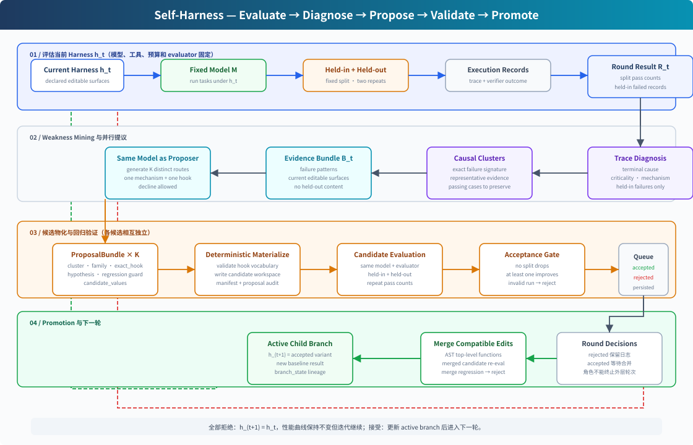
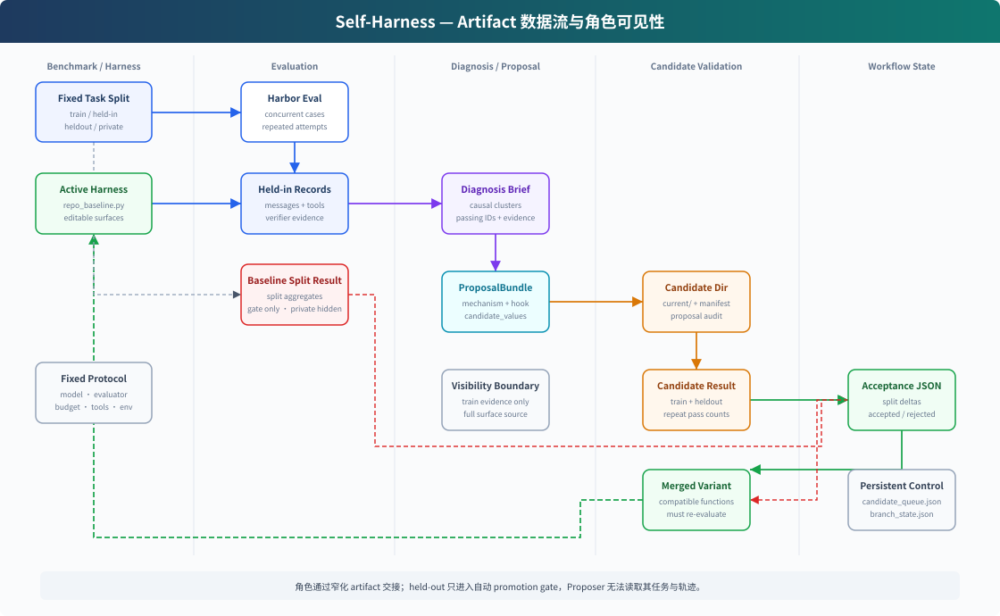

# Self-Harness 与 Search Harness 对照分析

## 分析范围

本文对照以下材料：

- Self-Harness 论文 `external_harness_works/self-harness/2606.09498v1.pdf`；
- 公开仓库中的 Diagnosis、Multi-Proposer、Materialization、Evaluation、Acceptance Gate
  和 Workflow 实现；
- Search Harness 当前的 Critic、Intervention Coordinator/Worker、Compiler、Evolution
  Runner、Harness Version Store 和插件体系。

下文会区分“论文描述”和“公开代码已实现”。Self-Harness 论文给出了固定轮数的完整算法，
公开 workflow 则以可恢复的阶段推进脚本实现该算法，并把 Diagnosis/Proposer 的真实模型调用
留给外部命令。

## 核心判断

Self-Harness 与本项目研究目标高度相似：两者都固定 Actor 模型参数和评估协议，只更新模型
外围 Harness，并要求更新由执行证据驱动。但两者选择了不同的搜索策略：

- Self-Harness 将搜索空间预先压缩为少量已声明 Hook，每轮直接并行生成可物化候选，再用完整
  held-in/held-out 回归决定是否提升；
- Search Harness 在完整评估和代码修改之间增加 Critic、Intervention 和 Compiler，通过
  prefix-fork 低成本试验发现机制，再将有效机制固化为插件。

前者用受限搜索空间和昂贵回归换取闭环稳定性；后者追求更开放、成本更低、因果证据更强的
机制发现，但当前缺少从 Intervention 假设到可执行候选的强协议，也错误地允许中间角色结论
终止全局搜索。





## 1. Self-Harness 的核心结构

### 1.1 论文算法

论文将一次迭代定义为：

1. 在固定 held-in 与 held-out 划分上评估当前 Harness；
2. 只从 held-in 失败轨迹构造 evidence bundle；
3. 使用同一个固定模型并行提出 `K` 个互异、最小化的 Harness 修改；
4. 每个候选都在 held-in 和 held-out 上重新完整评估；
5. 候选只有在至少一个 split 提升且另一个 split 不下降时才通过；
6. 合并兼容的通过候选并再次评估；全部拒绝时保持当前 Harness 不变；
7. 无论本轮是否接受候选，都进入下一轮，直到固定轮数 `T` 用完。

因此 Proposal、Diagnosis 和 Acceptance 都不能终止实验。它们只产生证据、候选或局部决策，
轮次推进由算法外层控制。

### 1.2 Weakness Mining

Diagnosis 并非直接按“超时”“文件缺失”等表面结果聚类。它先把失败轨迹规范化为模型步骤，
按 change 边界划分 stage，再让诊断模型输出：

- `terminal_cause`：验证器最终拒绝的具体原因；
- `criticality`：root cause、contributor、recovered friction 等因果地位；
- `agent_mechanism`：轨迹中可复用的 Actor 行为模式；
- 错误步骤、无用步骤、恢复情况和 missed oracle。

随后代码按三元组
`terminal_cause / criticality / agent_mechanism` 精确聚类，并生成面向 Proposer 的
Diagnosis Brief。Brief 同时列出应保留的 passing cases、失败簇规模、代表案例、边界证据和
共享诊断，但不规定应当修改哪个 Hook。

相关实现：

- `external_harness_works/self-harness/diagnosis/src/self_harness_diagnosis/trace.py`
- `external_harness_works/self-harness/diagnosis/src/self_harness_diagnosis/integrated.py`

### 1.3 Multi-Proposer

Proposer 读取：

- held-in Diagnosis Brief；
- 当前 Harness 的可编辑 surface 及其完整文本；
- passing behavior/regression guard；
- 本轮已经生成的其他 proposal 摘要，用于保证多样性；
- 可选的 Harness overview、surface hints 和当前评估观察。

它不读取 held-out 任务、轨迹或答案。每个 proposal 必须输出严格 JSON，并明确：

- 目标 failure cluster；
- `mechanism_family`；
- 一个 `exact_hook`；
- mechanism 到 Hook 的映射理由；
- 预期改善案例、需保护的通过案例和回归风险；
- 唯一一个 `candidate_values` 修改。

公开实现限制一个候选只能修改一个虚拟 Hook。解析器确定性检查 Hook 是否存在、是否属于声明的
mechanism family、修改是否真的改变 surface、不同 route 是否重复。没有可信修改时允许
`decline`，但禁止伪装成修改的 no-op。

相关实现：

- `external_harness_works/self-harness/proposer/src/self_harness_proposer/multi_proposer.py`
- `external_harness_works/self-harness/proposer/src/self_harness_proposer/hooks.py`

### 1.4 物化、评估与接受

模型不直接操作活动 Harness。确定性 materializer 将虚拟 Hook 值应用到父 surface，写出候选
workspace、manifest、proposal 和 variant 描述。候选通过环境变量注入 Harbor 评估。

Acceptance Gate 不由 LLM 决定。默认对 train/heldout 各运行两次，比较父 Harness 与候选的
平均 pass rate：

```text
accept = 至少一个 split 提升 AND 没有任何 split 下降
```

多个单独通过的候选会按顶层函数合并，合并结果必须重新经过完整评估和 Acceptance Gate；
不能安全合并的顶层修改会被拒绝。

相关实现：

- `external_harness_works/self-harness/proposer/src/self_harness_proposer/materialize.py`
- `external_harness_works/self-harness/eval/scripts/run_harbor_eval.py`
- `external_harness_works/self-harness/acceptance/scripts/run_acceptance_gate.py`

### 1.5 持续迭代与持久状态

公开 workflow 维护两份核心状态：

- `candidate_queue.json`：候选的 parent、状态、评估、验收和合并结果；
- `branch_state.json`：活动 branch、父 branch、depth、当前 surfaces 和基线评估。

候选状态包括 pending、rejected、accepted pending merge、accepted、merged 等。每评估一个
候选就落盘队列。被拒候选不会修改活动 branch；被接受候选创建 child branch，并把该候选的
评估结果作为下一轮 baseline。`--reuse-existing` 用于复用已有阶段 artifact。

公开脚本一次调用通常只推进当前队列或生成一批新候选，并不在单进程内执行论文中的固定
`T` 轮；需要外部重复调用。它提供可恢复推进，但不是完全自治的长循环。

## 2. Self-Harness 如何处理本项目当前问题

### 2.1 角色间信息传递

Self-Harness 不让角色直接共享不断增长的 Agent 对话，而通过版本化 artifact 传递信息：

| 上游 | 传递物 | 下游 |
| --- | --- | --- |
| Actor/Evaluator | trace、verifier outcome | Diagnosis |
| Diagnosis | 结构化 causal diagnosis 与 cluster brief | Proposer |
| Proposer | 严格 ProposalBundle | Materializer |
| Materializer | candidate workspace 与 manifest | Evaluator |
| Evaluator | split/repeat metrics | Acceptance Gate |
| Acceptance Gate | accepted/rejected | Workflow |

每一跳都缩小信息而不是传递整个上游上下文。Proposer 不需要理解 Diagnosis 的内部模型调用，
Materializer 也不需要解释 Proposer 的自然语言推理。

本项目当前主要以 CriticResult、Coordinator recommendation 和 Compiler clarification 传递
自由文本。尤其 Coordinator 到 Compiler 缺少一份稳定的可执行机制协议，导致“Worker 看起来
有效”与“Compiler 能写成合法插件”之间存在很大语义距离。

### 2.2 各角色的数据访问

Self-Harness 采用职责投影而不是全量共享：

- Diagnosis 可看到 held-in 失败任务描述、规范化步骤、工具结果摘录和 verifier evidence；
- Proposer 只看到 held-in 聚类 Brief、passing cases 和当前可编辑 Harness surfaces；
- Proposer 完全看不到 held-out 轨迹；
- Acceptance Gate 只读取父/候选的 split/repeat 聚合结果；
- Workflow 读取候选状态和版本关系，不理解任务内容。

这与本项目目前 Critic 工具直接暴露 `question`、`golden_answer`、`predicted_answer` 的做法不同。
Self-Harness 仍允许 Diagnosis/Proposer 看到 held-in 案例内容，因此并非严格的数据最小化；它
主要依靠不可见 held-out 回归抑制案例特化，而不是阻止优化角色接触训练案例。

### 2.3 协议与候选合法性

Self-Harness 把“什么可以修改”先定义为有限的 Hook vocabulary：prompt instruction、subagent、
skill、tool configuration、middleware、runtime control、permission/interrupt 等。Proposer 必须
将机制映射到其中一个 Hook，代码再完成 AST 级物化。

这消除了独立 Compiler 的大部分职责，也减少了以下失败：

- 自由发挥未知 runtime API；
- 生成多个互相依赖但不完整的文件；
- 提案只有语义描述，没有确定实现；
- proposal、实现和被评估对象不一致。

代价是搜索能力被 Hook vocabulary 上限约束。未预声明的新控制机制无法自然产生，新增复杂
模块也不是其主要搜索路径。

### 2.4 如何保证迭代持续

Self-Harness 使用四项机制避免单阶段阻断全局：

1. 外层轮数固定，角色没有全局终止权；
2. 一轮并行探索多个互异候选，不把全部希望压在一个最高优先方向上；
3. 全部候选被拒时，`h_(t+1) = h_t`，而不是结束实验；
4. queue 和 branch state 每阶段落盘，可以从 pending candidate 或活动 branch 恢复。

本项目当前固定选择 `direction_index=0`，Coordinator 在有限 continuation 后仍为
`inconclusive` 就返回 `no_supported_strategy`。Self-Harness 的控制原则说明，这种结论应当只
淘汰一个候选或一个假设，不应当成为实验终态。

### 2.5 成本控制

Self-Harness 没有 Intervention 层。每个合法 proposal 都直接做完整 held-in/held-out rollout，
因此控制逻辑简单且 realization fidelity 高，但评估成本很大。

本项目引入 prefix-fork Intervention 的动机仍然成立：先在少量失败案例上验证机制，再支付
完整 candidate evaluation 成本。问题不在 Intervention 本身，而在于当前 Teacher Worker 的
自由上下文修改与最终插件实现不等价。需要在二者之间增加 Realization Gate：用最终准备采用的
Hook 类型、模型 profile、prompt/schema 或确定性规则重新执行代表性试验，然后才交给 Compiler。

## 3. 本项目可能具有的创新性和优势

以下是相对 Self-Harness 的潜在创新点；它们只有在闭环实验中得到验证后才能形成研究贡献。

### 3.1 Teacher 优化 Student

Self-Harness 强调由同一个固定模型诊断并提出自身 Harness 修改。本项目显式区分 Student Actor
与 Teacher Adapter，可以研究更强模型如何发现小模型特有的失败模式并把能力压缩进非参数
Harness。这更接近 Harness distillation 或 teacher-guided harness evolution。

### 3.2 Intervention 与 prefix-fork

本项目可从真实失败轨迹的任意可恢复前缀分叉，在 Hook 点动态修改上下文并观察后续行为。这比
“生成代码后完整重跑”更适合：

- 低成本验证干预因果性；
- 区分机制触发失败、Actor 不遵循、检索失败和最终答案失败；
- 比较 Hook phase、上下文范围和干预策略；
- 在固化之前淘汰明显无效方案。

Self-Harness 的 before/after trace 分析发生在候选完整评估之后，并不是用于候选前机制发现。

### 3.3 更开放的插件化 Harness

本项目将 tools、prompts、extensions 作为可注册插件，并支持新增模块、Hook 状态、Hook 内模型
调用和 fixed/mutable 边界。Self-Harness 公开实现主要在单个 Python surface 的已声明函数上
替换返回值或函数体。本项目理论上可以探索超出预设 Hook vocabulary 的新组件组合。

### 3.4 多层审计与版本历史

本项目具有 Git-backed Harness Version Store、iteration journal、parent/digest 绑定、Compiler
代码校验和失败尝试记忆。Self-Harness 公开 workflow 使用文件 branch/queue 保存 lineage，结构
清晰但没有同等程度的 Git 历史和插件 manifest/fixed 边界。

### 3.5 更细粒度的随机性与行为指标

本项目支持 `example_id + replicate_id`、每题多次 rollout、Teacher Judge、token/step/tool 指标，
并计划为 Intervention 区分 activation、context mutation、process success、task score 和副作用。
Self-Harness 的公开 Acceptance Gate 主要基于两次重复的 split pass count。

## 4. 可借鉴的经验与教训

### 4.1 应直接借鉴

1. **Runner 独占全局控制权。** 角色状态只能影响下一转移，不能终止实验。
2. **Evidence Bundle。** Critic 不应把完整轨迹和自由文本建议直接传给后续角色，应输出经过
   职责投影的、可引用案例证据和因果字段。
3. **声明式机制协议。** 在 Coordinator 与 Compiler 之间加入 `MechanismSpec`，至少包含目标
   失败簇、Hook phase、触发条件、决策引擎、上下文动作、状态范围、fallback、预期行为、回归风险
   和证据 trial。
4. **并行候选队列。** 同一问题方向产生多个互异假设，每个假设独立失败，不串行绑死全局。
5. **不更新也是合法轮次。** 某轮没有候选通过时保留父 Harness，并继续其他方向或下一 search
   round。
6. **受控物化。** 尽量让 Compiler 调用稳定的组件创建/修改原语，而不是自由生成任意 runtime
   代码。
7. **合并后重评。** 单独有效的候选组合后可能冲突，必须把合并结果视为新候选。
8. **隐藏回归集。** 优化角色不能读取 held-out 内容，只能由 promotion controller 使用结果。

### 4.2 应改造后借鉴

- Self-Harness 的“一个候选只改一个 Hook”适合作为本项目的默认原子假设，不应成为永久硬限制；
  新机制可能需要 prompt、state 与 Hook 类协同修改。
- 确定性 no-regression gate 适合阻止明显退化，但本项目仍可保留 Critic review 解释成本、稳定性
  和行为变化。语义 Reviewer 应补充规则，而不应取代基本可比性和安全门槛。
- Self-Harness 直接完整评估所有 proposal 的成本太高。本项目应保留 Intervention，但增加真实
  实现形态的 Realization Gate。
- failure signature 的结构值得采用，但不一定按 LLM 生成字符串精确匹配；可先用受控枚举与
  结构字段聚合，再允许语义层做辅助合并。

### 4.3 需要警惕的局限

1. **held-out 被反复使用。** 每轮依据 held-out accept/reject 自适应搜索，长期会把 held-out
   变成验证集。还应保留从未参与迭代决策的 final test split。
2. **统计门槛较弱。** 默认两次重复且要求任一 split 不下降，对高方差任务可能误收或误拒；
   没有置信区间、配对检验或最小效果量。
3. **历史失败记忆的论文/代码差距。** 论文称 Proposer 接收此前尝试摘要，但公开 workflow
   主要把本轮 proposal 用于去重；rejected queue 没有自动注入下一轮 prompt。全部拒绝后可能
   在相同证据上重复生成相似修改。
4. **并非完全自治。** Diagnosis 与 Proposer 模型调用由外部 command 提供，workflow 需要外部
   重复调用才能形成论文中的多轮循环；“同一模型”也未由公开控制面强制校验。
5. **有限 Hook vocabulary。** 高物化成功率来自窄搜索空间，不能据此证明开放式 Harness 新机制
   也能可靠发现。
6. **案例内容仍会暴露。** held-in 的任务描述和 representative evidence 会交给诊断/提议阶段，
   泛化主要靠 held-out gate，而非严格防止案例级过拟合。

## 5. 对本项目 Evolution 状态机的综合建议

结合 Self-Harness，建议采用以下层级：

```text
Accepted Harness generation
  -> held-in evaluation + causal evidence bundle
  -> direction portfolio
  -> hypothesis queue (parallel, independent)
      -> cheap Intervention trials
      -> mechanism metrics
      -> Realization Gate
      -> executable candidate
  -> candidate held-in/held-out evaluation
  -> deterministic safety/comparability gate + semantic review
  -> accept/reject candidate
  -> merge compatible accepted candidates and re-evaluate
  -> accepted child generation, or unchanged parent search round
```

其中：

- `inconclusive` 只表示假设需要补证据或暂停，不是 run 终态；
- `rejected` 只淘汰一个 hypothesis/candidate；
- `decline` 允许某个方向不产生候选，但 Runner 继续其他方向；
- 只有顶层 Stop Policy 能因全局 token/time/candidate 预算、用户请求或目标达成而暂停实验；
- 所有暂停都保留 queue、branch、hypothesis ledger 和 artifact，可继续或从旧节点创建分支。

Self-Harness 最值得本项目吸收的不是某个具体 prompt，而是三个控制原则：**受限而明确的候选
协议、并行且相互独立的候选分支、由确定性控制面而非角色话语决定版本推进。** 本项目的机会则
是在这些稳定原则上保留 Intervention、开放插件和 Teacher-to-Student 机制发现能力。
