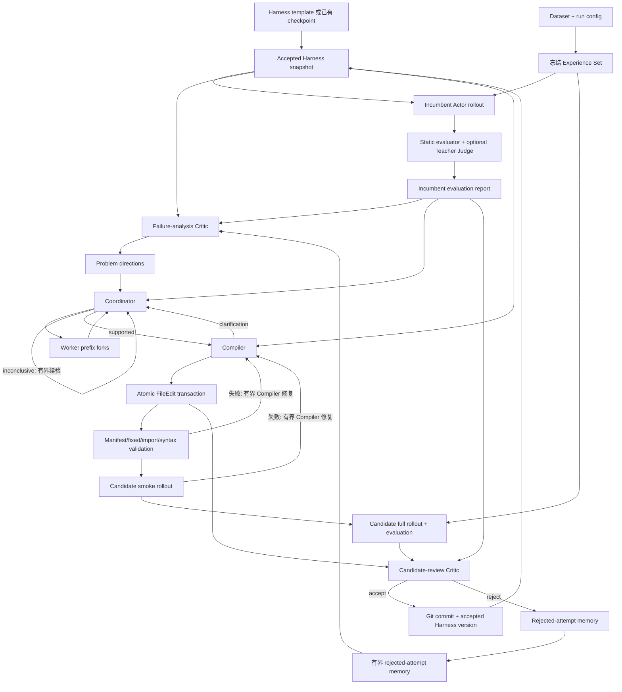

# Evolution 主体数据流

## 文档范围

本文以数据流和状态转移为主线，说明一次离线 Harness 进化实验如何从已接受的 Actor
Harness、数据集和运行配置出发，依次产生 rollout、evaluation、Critic 分析、Intervention
证据、Compiler candidate、候选评审与新 checkpoint。

本文前半部分描述当前代码已经实现的行为。末尾的“目标状态机”记录已经确认、但尚未落地
的调整方向。不要把目标状态机误认为当前 Runner 已经具备的能力。

## 核心身份与事实来源

整条管线使用四组不同的身份，不能互相替代：

- `checkpoint_store_id + harness_version`：一个已经接受、可从 Git commit 恢复的 Harness。
- `run_dir`：一次完整 Evolution 实验及其冻结配置、Experience Set 和阶段日志。
- `example_id + replicate_id`：一个逻辑问题下的一条具体 Actor rollout。
- `iteration_id + candidate_digest`：Version Store 中一次未接受、已拒绝或待处理的候选事务。

两个 append-only journal 分别承担不同职责：

- `<run_dir>/events.jsonl` 是 Evolution Runner 的阶段恢复与决策事实来源。
- `<checkpoint_store>/.harness-store/iterations.jsonl` 是候选 patch、validation 和
  accept/reject 的事实来源。

Accepted Harness 的实际文件历史保存在 Checkpoint Store 自己的 Git 仓库中。角色日志、
rollout 和 evaluation report 是证据 artifact，不直接代表版本状态。

## 全局数据流



当前实现只选择 Critic 的 `direction_index=0`。Coordinator 在固定续验预算后仍为
`inconclusive`，或返回 `rejected`，Runner 会结束整个 run；不会自动尝试其余方向。该行为
是现状，不是目标状态机。

## 1. 选择或初始化 Harness

### 1.1 从初始化模板创建 Checkpoint Store

输入：

- `harness_templates/actor/<template>/plugins/`；
- `.env` 中注册 Harness 所需的环境配置；
- 新的 checkpoint store 路径和稳定 store ID。

Version Store 使用真实 registry 组装并校验模板，然后：

1. 创建独立 Git 仓库；
2. 将模板保存为 `plugins/`；
3. 创建第一个 accepted commit；
4. 登记 `harness_v0001`、内容 digest 和初始化来源。

输出是一个可解析的 accepted `HarnessSnapshot`。初始化不会覆盖已有 store。

### 1.2 从已有 Checkpoint Store 启动新实验

Runner 读取 store 的 accepted version 列表，并以当前最新版本作为 `initial_version`。新 run
不会复制 Harness 历史；`run.json` 保存 checkpoint store 路径和 ID，后续通过 Version
Store resolve/stage 接口加载 snapshot。

### 1.3 恢复中断实验

`resume` 从 `<run_dir>/run.json` 恢复冻结配置、checkpoint store 和 Experience Set 身份，
再读取 `events.jsonl`：

- 已完成且 artifact 合法的阶段直接复用；
- 已持久化但违反当前 schema 的 Critic artifact 会失效并重跑；
- Version Store 已 accept/reject、但 Runner 尚未记事件时会先执行对账；
- 未记录完成事件的阶段从对应阶段重新执行。

当前尚有一个已知限制：未完成 iteration 的 parent 没有严格从既有
`iteration_started.parent_version` 冻结恢复，而会再次读取 store 的 latest version。因此同一
store 在中断期间不应由其他 writer 推进。

## 2. 冻结实验输入

启动新 run 时，Dataset Loader 按配置读取 JSONL 数据集并应用 `supported` 等筛选，然后按
`--limit` 物化：

```text
<run_dir>/experience_set.jsonl
```

同时在 `run.json` 保存 Experience Set 的数量和 digest。该文件在整个 run 中同时供 incumbent
与 candidate 使用，保证比较使用同一组逻辑问题。

每个 `example_id` 按 `--rollouts-per-example` 展开为 `r000..rNNN`。实际 sampling seed 由角色
基础 seed 与 replicate index 派生，rollout 顺序保持为 Experience Set 顺序及其 replicate
顺序。

## 3. 评估当前 accepted Harness

输入：

- accepted `harness_version`；
- 冻结的 `experience_set.jsonl`；
- Actor model role、rollout seed、最大步数和并发配置。

数据流：

1. Version Store 将 snapshot 暂存为一个只读可运行 plugins root。
2. Registry 从该目录组装 prompt、tools、extensions、hooks 和 model profiles。
3. Actor 对每个 `(example_id, replicate_id)` 独立执行 AgentLoop。
4. rollout 以有界线程池并发，但按输入顺序写入 JSONL。
5. Evaluator 先执行静态答案判断。
6. `needs_teacher` 且启用 Teacher Judge 的记录进入独立有界并发评分。
7. 结果分别聚合为 rollout 级和 example 级指标。

主要输出：

```text
iterations/<NNNN>/incumbent_rollouts.jsonl
iterations/<NNNN>/incumbent_report/
  summary.json
  summary.md
  per_example.jsonl
  per_rollout.jsonl
```

同一 accepted parent 在本 run 内已有完整 evaluation 时，后续 candidate 被拒后可以复用，
不重复消费 Actor 和 Judge 调用。

## 4. Failure-analysis Critic

输入：

- incumbent report 及其 source rollout；
- 当前 Harness version、digest 和 manifest 摘要；
- 最近若干 rejected candidate 的有界失败摘要。

初始 model input 只包含聚合摘要和紧凑 Harness 元数据。Critic 可按需调用只读工具分页读取
evaluation case、指定 `(example_id, replicate_id)` 的完整轨迹、Harness manifest 和组件源码。
它不能修改 Harness、运行 retriever、创建 intervention 或提交 patch。

输出 `CriticResult`：

```text
analysis
problem_directions[]:
  problem
  observed_pattern
  excluded_causes[]
  desired_behavior
  success_criteria[]
  constraints[]
evidence_requests[]
review = null
```

若 `problem_directions` 为空，当前 Runner 返回 `no_direction` 并结束 run。若存在多个方向，
当前只把索引 0 交给 Coordinator。

## 5. Coordinator 与 Intervention Worker

Coordinator 接收：

- 一个 Critic `problem_direction`；
- incumbent evaluation 的失败样本池；
- source Actor rollout；
- 可选的上一轮 trial ledger；
- 可选的 Compiler clarification。

Coordinator 可分页列出、指定或随机选择失败案例，读取一条 replicate 的可恢复 prefix
时间线，并以以下扁平参数启动 Worker trial：

```text
example_id + replicate_id + prefix_id
intent + hook_phases[] + hook_instructions[]
```

Worker 将 `prefix_id` 解析为精确的 `step + phase`，重建该边界之前的模型可见
`ModelInput`。Teacher Worker 在指定 Hook phase 使用受限工具修改上下文或 final decision，
随后把控制权交还 Student Actor 继续生成。完整分支、Hook action、Teacher trace、Actor trace、
评分和 provenance 保存为独立 Intervention artifact。

Coordinator 汇总 trial ledger，输出：

```text
analysis
verdict = supported | rejected | inconclusive
selected_trial_id
recommendation
```

当前分支规则：

- `supported`：进入 Compiler；
- `inconclusive`：继承旧 ledger，分配一份新 trial 预算继续验证；
- `rejected`：不续验；
- 连续 `inconclusive` 达到 `--intervention-continuation-limit`：整个 run 返回
  `no_supported_strategy`。

Coordinator/Worker 只产生临时轨迹和机制证据，不修改 Actor plugins。

## 6. Compiler 与候选事务

Compiler 只接受 `supported` Coordinator artifact，并沿 `direction_source` 校验 Critic、
Coordinator 和当前 parent Harness 的 version/digest 绑定。

Compiler 可读取 parent Harness 文件、组件定义和 Hook authoring guide，但不能直接增量修改
workspace。它必须在最终结果中一次性返回：

```text
summary
edits[] = write/delete FileEdit
clarification = null
```

或者不返回 edits，只返回具体 `clarification`。Host 将完整 edits 作为一个原子 transaction
应用到 `IterationSession` 的内存 overlay，并持久化 patch event。

### 6.1 Compiler clarification

Runner 拒绝当前空 candidate transaction，把 clarification、原 Coordinator ledger 和同一
problem direction 返回 Coordinator。Coordinator 补充 Worker 实验后再次调用 Compiler。
该循环受 `--compiler-revision-limit` 约束；当前预算耗尽会返回 `needs_clarification` 并结束
run。

### 6.2 确定性校验与 smoke

候选依次接受：

1. manifest 和 entrypoint 结构检查；
2. parent fixed 组件边界检查；
3. UTF-8 与 Python syntax 检查；
4. AST 禁止动态属性访问等规则检查；
5. 真实 registry import/assembly；
6. 从 Experience Set 可复现抽样的真实 Actor smoke rollout。

失败信息和完整 Compiler 结果进入新的 Compiler 会话，要求基于同一 parent 返回替换事务。
校验修复受 `--compiler-validation-repair-limit` 约束。通过后生成包含 `iteration_id`、parent、
candidate digest、summary 和 validation report 的 `CandidateArtifact`。

## 7. 候选全量评估

Runner 从 Version Store journal 重建 pending candidate，在临时目录中 stage 其完整 workspace，
然后使用与 incumbent 相同的：

- Experience Set；
- replicate 数量与复合身份；
- sampling seed schedule；
- Actor 与 Judge 流程。

输出：

```text
iterations/<NNNN>/candidate_rollouts.jsonl
iterations/<NNNN>/candidate_report/
```

重复出现的已拒绝 candidate digest 会在完整 rollout 前被拒绝。

## 8. Candidate-review Critic

Candidate review 是 Critic 的第二种运行模式。输入的 primary 是 candidate，comparison 是
incumbent，另加 Harness change summary。

Critic 可访问：

- 两侧聚合 metrics；
- example/replicate 对齐后的 improved、regressed、unchanged 转移；
- 指定案例的成对 evaluation 与完整 trajectory；
- candidate 相对 parent 的文件和 manifest 变化。

输出仍为 `CriticResult`，但此时：

```text
review:
  decision = accept | reject
  reason
```

Critic 的决定是候选语义验收来源；确定性 validator 只负责工程边界，不替代效果判断。

## 9. 接受、拒绝与下一轮

### 9.1 Accept

Runner 调用 `IterationSession.accept()`：

1. 再次确认 candidate validation 与 latest-parent 约束；
2. 将 overlay 落入 Checkpoint Store 的 `plugins/`；
3. 创建 Git commit；
4. 在 `versions.jsonl` 登记新 `harness_vNNNN`；
5. 在 Version Store 与 Evolution journal 记录 accept；
6. 下一外层 iteration 使用新 accepted version。

### 9.2 Reject

拒绝不创建 Git version。candidate 摘要、digest、validation、evaluation、review 和原因保留在
两个 journal 及 iteration artifact 中。Runner 将最近若干拒绝尝试压缩成有界 failure memory，
输入下一次 failure-analysis Critic。

当前 `max_iterations` 按 accept/reject candidate decision 计数，而不是按 Critic、Coordinator
或 trial 调用计数。因此在进入 Compiler 之前结束的 run 会显示 `completed_iterations=0`。

## 10. 当前预算与停止路径

| 预算或限制 | 控制对象 | 当前耗尽行为 |
|---|---|---|
| `max_iterations` | candidate accept/reject 次数 | 返回 `completed` |
| `intervention_max_steps` | 单次 Coordinator AgentLoop | 无有效结果时失败或保存错误 |
| `intervention_max_trials` | 单次 Coordinator 的新 Worker trial | 要求 Coordinator给出结论 |
| `intervention_continuation_limit` | inconclusive 续验次数 | 返回 `no_supported_strategy` |
| `compiler_max_steps` | 单次 Compiler AgentLoop | 协议修复失败后进入外层修订或失败 |
| `compiler_revision_limit` | clarification 往返次数 | 返回 `needs_clarification` |
| `compiler_validation_repair_limit` | 协议、静态校验和 smoke 修复 | reject candidate，继续下一 iteration |
| `rollouts_per_example` | 每个逻辑问题的采样次数 | 同时作用于 incumbent 与 candidate |
| `failure_memory_limit` | 输入后续 Critic 的拒绝摘要数量 | 丢弃更早的摘要，不删除原 artifact |

当前终态为 `completed`、`no_direction`、`no_supported_strategy`、`needs_clarification` 或
`failed`。一旦写入 run terminal event，`resume` 会直接返回该结果，不继续搜索。

## 11. 已确认的目标状态机（尚未实现）

后续重构的核心原则是：Critic、Coordinator、Compiler 和 candidate reviewer 只产生局部
判断，不拥有终止整个实验的能力。`inconclusive`、`rejected`、`no_direction` 和
`needs_clarification` 应成为 Runner 的转移信号，而不是直接成为 run 终态。

计划采用以下层级：

```text
generation
  search_round
    direction_attempt
      hypothesis_attempt
        intervention_trial
      candidate_attempt
        compiler_revision
        candidate_evaluation
        candidate_review
```

- `generation` 只在新 Harness 被接受时递增。
- 一个 direction 失败后尝试其他方向，而不是结束 run。
- 一个 hypothesis inconclusive 时可以补实验、修订或被替换，并保留完整证据账本。
- Compiler clarification 返回同一 hypothesis；candidate reject 返回当前 generation 的搜索层。
- 旧 artifact 不覆盖，回退或修订创建新 revision/branch。
- 只有顶层 Stop Policy 可以因用户请求、全局时间/token/trial/candidate 预算、达到实验目标或
  不可恢复环境错误而暂停或结束 run。
- 预算耗尽应写入可恢复的暂停状态和完整报告，而不是把某个角色的局部失败解释成“实验无可行
  策略”。

Intervention 的反馈还将拆为机制指标与任务指标。前者记录 Hook 是否触发、上下文是否按预期
变化、Actor 是否执行目标行为和控制权是否恢复；后者记录最终答案、token、工具调用和副作用。
只有可执行形态通过 realization validation 后，机制证据才交给 Compiler 固化。
