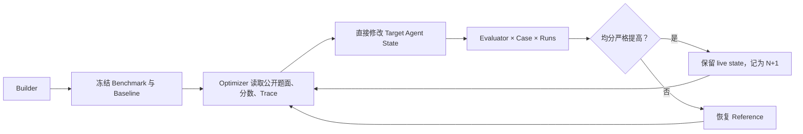
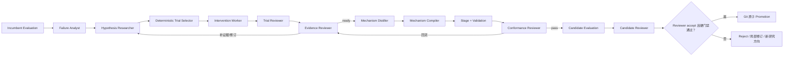

# PenguinHarness 与 Search Harness 自进化实现横向比较

> 分析日期：2026-08-10  
> Search Harness 口径：Git `006426f` 加当前工作区未提交改动  
> PenguinHarness 口径：`research/penguin-harness-main`，Git `006426fb39259d06835b55771eef3b3e05fc70f3`  
> 方法：静态阅读两边代码、技能、模板、测试、运行产物与既有审计；本次未重新发起模型实验。  
> 术语：两边统一使用 `Agent = Model + Harness`；“进化”指 Harness 状态/模板变化，不指模型权重训练。

## 1. 结论先行

两套系统解决的并不是同一难度的问题。

- **PenguinHarness 的公开成功，首先是一个经过精心构造、低维、可直接写入 `AGENTS.md` 的信息缺口学习任务。** 失败原因是缺少任意的内部报告格式；通过样例几乎直接暴露所缺规则；评分是确定性代码；反思阶段和下一轮执行使用同一 Agent State 表达。因此，`发现规则 → 写入规则 → 重新执行` 的因果链很短。
- **Search Harness 试图解决的是高维的行为机制发现与编译问题。** 它从真实 HotpotQA 失败轨迹中归纳干预假设，经多案例 Trial、Evidence Review、Mechanism Distillation、代码编译、Conformance、全量 Candidate Evaluation 后才允许晋级。中间任何语义漂移都会放大。
- **在控制面工程上，Search Harness 明显强于 PenguinHarness。** 它有代码级事件状态机、严格输入输出契约、Candidate Workspace、内容 digest、Git Version Store、确定性校验、原子晋级、恢复、预算与审计。Penguin 的完整产品流程大部分由 Skill 文本约束，Core 提供的是通用 Agent/Session/Trace/Snapshot 能力。
- **Search Harness 当前失败的主因不是“角色不够多”或“控制器不够强”，而是研究语义没有闭合。** Trial 阶段证明的机制，到了 Candidate 运行时可能换成能力更弱、温度更高的 Student/Hook Model 来判断；Evidence 的样本分布又不足以约束近邻负例；Conformance 主要证明“实现忠实于 Mechanism”，不能证明“Mechanism 本身在全分布上有选择性和净收益”。
- **Search Harness 已经证明会拒绝坏候选，但尚未证明会持续产生好候选。** 这是一项真实能力，但它属于“安全闭环”，不是“有效进化”。

一句话判断：

> PenguinHarness 用较弱的代码控制和较强的问题整形，展示了短链路自编辑；Search Harness 用较强的代码控制挑战较难的语义迁移，当前瓶颈在可搜索机制空间、证据选择和 Trial/Deployment 一致性，而不在版本控制或流程编排。

## 2. 先统一“成功”的定义

若不区分成功层级，两边很容易被错误比较。

| 层级 | 定义 | Penguin 公开示例 | Search Harness |
| --- | --- | --- | --- |
| L0：闭环完成 | 能完成评测、编辑、复评、保留/拒绝 | 是 | 是，多条真实 Run 已到 Candidate Review |
| L1：发生晋级 | 某次 Candidate 分数过门禁并成为 N+1 | 是，示例保留更高均分的 `AGENTS.md` | **历史上有**；默认 `search_student` Store 存在 `harness_v0002` |
| L2：可复现净提升 | 多次独立运行仍改善，且稳定性/成本可接受 | 本仓库公开示例不能证明 | 当前主线尚未证明 |
| L3：分布外泛化 | 在未参与诊断/优化的 holdout 上持续改善 | 未提供证据 | 未提供独立 holdout 晋级证据 |
| L4：持续递归进化 | 多代自动产生并接受可泛化的新版本 | 递归示例展示两轮，但无完整产品级证据 | 尚未实现实证闭环 |

### 2.1 Search Harness 的事实口径修正

“从未成功迭代”如果指“从未有版本号晋级”，并不严格成立：

- `harness_checkpoints/search_student/.harness-store/versions.jsonl` 中存在 `harness_v0002`；记录显示 20 个 Example、每题 3 次 rollout，准确率从约 `0.7333` 到 `0.7833`，总 token 比率约 `1.24×`，Candidate Reviewer 与 Promotion Gate 都接受。
- 但该增益全部来自一个目标案例，缺少正式负控制；记录本身也承认 year/age 类型未展示收益。因此它更接近一次**局部晋级**，不是稳定、广泛、可复现的进化证明。
- 当前 Qwen 主线的 `search_qwen3-8b*` 独立 Version Store 均只有 `harness_v0001`；2026-08-06 至 08-09 的主要真实实验都没有晋级。
- 归档设计还记录过另一条 6 样本真实 Run 接受 `harness_v0002`，但 incumbent/candidate accuracy 都为 `1.0`、token 约翻倍，文档明确说它只证明闭环与决策边界可运行。

因此，更准确的项目状态是：

> Search Harness 发生过局部或闭环验证性质的 Promotion，但当前架构与当前主线尚未证明“能够稳定找到净收益候选并持续产生 N+1”。

同时，`docs/audits/current-system-handoff-2026-08-08.md` 的“所有相关 Store 仍为 v0001”与默认 `search_student` Store 的 v0002 容易造成口径冲突。后续应在文档中明确“当前实验族”“隔离 Store”“默认 Store”和“历史验证 Store”的身份关系。

## 3. 两套系统的总体架构

### 3.1 PenguinHarness：Skill 驱动的短闭环



核心可进化变量是 `AGENTS.md`、局部 Skills 和少量配置。Builder、Optimizer、Evaluator 不是三套专用服务，而是普通 Agent 在不同 Session 中加载不同 Skill 后扮演的角色。完整流程的 Benchmark freeze、信息边界、YAML 协议、严格提分和回滚主要写在 Skill 中。

### 3.2 Search Harness：代码状态机驱动的研究—编译长闭环



这里 Controller 是显式的代码控制面：不可变 `WorkItem`、持久化 `EffectResult`、append-only journal 和纯 transition 共同决定下一步。Teacher 只在受限职责内产出事实、判断、机制或候选，不能自行改变工作流或直接发布版本。

## 4. 角色与职责横向比较

### 4.1 角色映射

| Penguin 角色/部件 | Search Harness 中最接近的对应物 | 关键差异 |
| --- | --- | --- |
| Builder | 没有单一对应角色；数据集/评测配置由系统外准备，Failure Analyst 从固定 Evaluation 起步 | Penguin 把“设计量具”纳入进化；Search 默认量具已存在，不让 Teacher 改 Benchmark |
| Target Agent | Student Agent | 都是被优化对象；Penguin 主要改持久化指令，Search 可改 Template 中 Prompt、Hook、Extension 等 Harness 结构 |
| Optimizer | Failure Analyst + Hypothesis Researcher + Evidence Reviewer + Distiller + Compiler，外加 Controller | Penguin 一个 Agent 同时诊断和写状态；Search 把认识论步骤拆成多个闭集角色，并把流程权交给代码 |
| Evaluator | Evaluation Runner/Judge + Trial Reviewer + Conformance Reviewer + Candidate Reviewer | Penguin Evaluator 一次完成 Target 执行与私有 Rubric 评分；Search 把结果判分、试验解释、实现保真和最终效应判断拆开 |
| Scoreboard | Evaluation Report + Candidate Attempt Journal + Version Record | Penguin Scoreboard 由 Agent 聚合写入；Search 原始 rollout、聚合指标、审查结果和 Promotion receipt 分层保存 |
| Snapshot/Reference | HarnessSnapshot + CandidateWorkspace + TemplateVersionStore | Penguin 先改 live state、失败再恢复；Search 候选从未进入 Accepted Tree，接受时才提交 |

### 4.2 职责边界与控制权

| 问题 | PenguinHarness | Search Harness | 判断 |
| --- | --- | --- | --- |
| 谁决定下一步 | Builder/Optimizer 按 Skill 自行推进 | Controller transition 函数 | Search 更确定、可恢复 |
| 谁能改 Target | Optimizer 可直接写 live Agent State | 只有 Compiler 通过受控 Candidate Workspace 写允许的文件 | Search 权限更小、审计更强 |
| 谁定义评测 | Builder 创建并冻结 Benchmark | 外部固定 Experience/Evaluator | Penguin 自包含；Search 更防止移动球门 |
| 谁解释失败 | Optimizer | Failure Analyst 与后续多角色 | Penguin 信息连续；Search 分工清晰但有交接损耗 |
| 谁判断机制成立 | Optimizer 根据分数/Trace | Trial Reviewer + Evidence Reviewer + Distiller | Search 更显式，但判断链更长 |
| 谁判断实现正确 | 无独立角色 | Deterministic Validation + Conformance Reviewer | Search 明显更强 |
| 谁决定晋级 | Optimizer 执行 `score > reference` | Candidate Reviewer `accept` 与确定性 Promotion Gate 取交集 | Search 更保守 |
| 谁执行发布 | Optimizer保留 live state 并写 Scoreboard | Version Store 校验后 Git commit，生成新 Version Record | Search 更接近事务发布 |

### 4.3 分工收益与分工成本

Search Harness 的九个 Teacher Role 解决了 Penguin 的几个软约束问题：

- Writer 与 Reviewer 分离；
- 行为证据、机制规格、代码实现和全量效果分离；
- 每个角色只获得职责所需的工具和资源；
- 输出必须满足独立 Pydantic Contract；
- 回流可以定位到 evidence、mechanism 或 implementation 层。

但它也引入了四类新成本：

1. **语义接力损耗**：Failure Direction、Hypothesis、Trial Review、Evidence Review、Mechanism、Candidate 之间需要多次压缩和重述。
2. **协议失败面扩大**：任一角色耗尽回合、没有提交终态工具、字段不合法或资源义务不满足，都可能阻断链路。
3. **错误被形式化后放大**：一份看似完整但边界错误的 Mechanism 会被 Compiler 忠实实现，Conformance 甚至可能确认其“实现无误”。
4. **成本随角色链相乘**：增加角色并不自动增加有效信息；若 Evidence 不变，重复 Review/Revision 只会增加 token。

Penguin 的单 Optimizer 让诊断上下文连续、编辑回路短，却更依赖模型自律，也更难审计“为什么这次修改是被哪条证据授权的”。

## 5. 上下文设计与输入输出协议

| 维度 | PenguinHarness | Search Harness |
| --- | --- | --- |
| 系统上下文 | `AGENTS.md` 全文 + Skill 元数据 + 环境信息 + 工具 Schema | 角色专用 system prompt + 经 Pydantic 验证的 Role Input + 程序生成的 Resource Context + 角色工具 |
| Skill/能力加载 | Skill 正文按需读取，常驻上下文较小 | Teacher Template 在装配时固定 prompt/output/tools；外部资源通过工具按需读取 |
| Session 复用 | Builder/Optimizer/Evaluator 使用独立 Session；Target 通常每次新建 | Hypothesis/Evidence 等修订可恢复同一 Role Session，追加结构化反馈 |
| 读数据边界 | 主要靠 Skill 规定不读 Rubric/Gold；绝对路径工具仍可访问 | Role-specific tool capability + resource-backed obligation；比 Penguin 硬，但不是通用 OS sandbox |
| 输入协议 | Builder/Optimizer 自然语言；Evaluator 文本 YAML 请求 | 每个 Role 都有版本化 Pydantic Input Contract |
| 输出协议 | Evaluator 返回“纯 YAML”，由调用 Agent 检查 | 原生 structured tool call + Pydantic Output Contract，`extra=forbid`，记录 schema digest |
| 审计 | Trace、session id、Scoreboard | Role Artifact 保存输入、输出、模型、usage、tool calls、transcript、资源读取和产物引用 |
| 主要风险 | Prompt 规则未被遵守、YAML 漂移、信息越权 | Contract 复杂、上下文累积、终态提交失败、跨角色语义压缩 |

Search 的协议设计更可靠，但当前 `RoleSession` 会把旧消息、输出历史和反馈持续累积。既有审计已观察到 Hypothesis Researcher 随修订从约 12 个 transcript turn 增至 37 个，单次修订可达到 5.8 万至 12.5 万 token；这说明“上下文连续”同时也是成本与注意力污染源。

一个关键差异是：Penguin 反思后写入的 `AGENTS.md`，正是下一次 Target Session 直接加载的行为规则；Search 的 Trial 则可能由强 Teacher 进行干预和判断，最终 Candidate 却把语义委托给弱 Student Hook Model。前者是**同一表示、同一执行者**，后者存在**跨模型语义传递**。

## 6. 候选版本、发布与恢复

### 6.1 PenguinHarness

1. 以当前 live Agent State 为 Reference；
2. 确保有 Snapshot/原文件记录；
3. Optimizer 直接写 live `AGENTS.md`/Skill/安全配置；
4. Candidate 评测期间要求状态不变；
5. 提分则不回滚，并写 Scoreboard；否则恢复 Reference。

优点是简单、反馈快、状态变量直观。缺点是 Candidate 构建期间 live state 已被修改，Promotion 不是独立原子事务；冻结、回滚顺序和 Scoreboard 正确性多由 Skill 保证。

### 6.2 Search Harness

1. 从最新 Accepted `HarnessSnapshot` 打开内存 Candidate Workspace；
2. Compiler 只能对 Template-root-relative 路径执行受控 write/delete；
3. overlay 形成稳定 digest，Stage 后做结构和源码校验；
4. Candidate Attempt 的 patch、validation、accept/reject 写入 append-only journal；
5. 接受前再次确认 parent 是最新 Accepted、digest 未变化；
6. 通过临时目录替换 Template，Git commit 后追加 Version Record；失败会恢复旧 Template。

Search 的版本控制是两边最成熟的部分。当前没有稳定 N+1，不能归因于“发布不可靠”；真实运行已经多次安全地把坏 Candidate 拦在 Accepted Tree 外。

## 7. 评测、晋级门禁与稳定性

| 维度 | PenguinHarness | Search Harness | 谁更强 |
| --- | --- | --- | --- |
| Benchmark 冻结 | Skill 规定冻结，代码无专用锁 | Evaluation/Experience 由运行配置和产物固定 | Search |
| Baseline/Candidate 可比性 | Formal Baseline 每 Case 1 run，Candidate 可多 run，方差不对称 | 同一 Experience、相同 replicate 数和运行配置，支持配对轨迹 | Search |
| 单次判分 | 通用任务由模型 Evaluator 按私有 Rubric；示例为确定性代码 | HotpotQA 静态判分 + 可选 Judge；报告区分 unresolved | Search 略强 |
| 晋级条件 | 完整有效且均分严格大于 Reference | Validation + 无运行错误 + accuracy delta + token ratio + Reviewer accept | Search |
| 统计显著性 | 无 | 无 | 都不足 |
| Holdout | 无独立 holdout | 当前没有晋级专用 holdout | 都不足 |
| 实现保真 | 无独立阶段 | Conformance Reviewer + deterministic source review | Search |
| 原子发布 | 无专用事务 | Git-backed Version Store 原子化接受 | Search |
| 坏候选恢复 | Skill 编排 Snapshot/原文件回滚 | Reject Candidate Attempt，不改变 Accepted Tree | Search |

### 7.1 Search 当前门禁并没有配置成“必须变好”

当前工作区 `config/runtime.yaml` 设置：

- `min_accuracy_delta: -0.02`：允许最多 2 个百分点的准确率下降；
- `max_total_token_ratio: 5.0`：允许 Candidate token 达到基线 5 倍；
- `max_total_tokens: null`：整个 Evolution Run 没有总 token 上限；
- `max_work_items: 200`、Compiler/Candidate revision 各 10 次。

代码中的 Promotion Gate 确实会强制执行这些阈值，但阈值本身比较宽。2026-08-09 Candidate 在准确率 `0.6711 → 0.6711`、总 token `579,635 → 1,118,002`（`1.93×`）时，安全门禁仍通过，最后由 Candidate Reviewer 的 `reject` 阻止晋级。

这说明当前体系的最后安全性部分依赖模型 Reviewer；确定性门禁并没有表达“Candidate 必须提供正净收益”。

### 7.2 Search 已有的稳定性正向证据

- 2026-08-06 Candidate 表面准确率约 `+0.58` 个百分点，但稳定正确 `45 → 42`、不稳定 `16 → 20`、token `5.58×`，Reviewer 和成本门禁共同拒绝。
- 2026-08-09 Candidate 实现对 Trial 样例 `12/12 faithful`，但全量评测没有准确率收益、token `1.93×`，Reviewer 拒绝。
- 多条 Run 能在 Evidence、Compiler、Conformance 或 Promotion 层暂停/回流，而没有污染 Accepted Version。

这些数据证明控制系统能识别“实现忠实但产品效果不成立”的候选；这是 Search 相比 Penguin 简化示例更有价值的能力。

## 8. 为什么 Penguin 能公开成功，而 Search 当前主线不能稳定迭代

### 8.1 Penguin 把问题设计成了可学习的信息缺口

公开示例的报告任务有 10 个确定性原子得分点：5 个内容点从任务本身可得，5 个内部格式点只存在于 `AGENTS.md`。空白 `AGENTS.md` 无法猜出固定 marker、标题、Classification 和 footer，因此基线稳定失败。

反思时，Agent 得到自己的失败报告和一份通过报告。通过报告直接提供了所缺结构；递归第二轮再提供多份样例，使固定常量可辨认。它主要测试的是：

> 模型能否从正例提取显式字符串规则，并将规则持久化到下一轮会直接读取的位置。

这不是作弊；它是一个清晰、可演示的最小自进化任务。但它与“从真实问答失败中发现安全、低成本、可泛化的 Hook 机制”不是同一难度等级。

### 8.2 Penguin 的因果链只有一个主要语义跃迁

```text
通过样例中的格式差异
    → Agent 写成自然语言规则
    → 同一个 Agent 在新 Session 读取规则
    → 确定性代码检查字符串
```

Search 当前链路包含更多跃迁：

```text
HotpotQA 失败轨迹
    → Failure Direction
    → Intervention Hypothesis
    → Teacher 执行的 counterfactual Trial
    → Reviewer 对 Trial 的解释
    → Evidence 概括
    → 可执行 Mechanism Spec
    → Python Hook 实现
    → Student/Hook Model 运行时 predicate
    → Student 是否采纳注入指令
    → 全分布准确率、稳定性与成本
```

每一步都可能局部“正确”，但全链路净效果仍为负。

### 8.3 Search 的首要根因：Trial 与 Deployment 语义不一致

2026-08-09 的候选提供了最直接的证据：

- Evidence/Probe 阶段使用 `deepseek-v4-flash`，thinking 开启、temperature `0.2`；
- 部署后的 Hook 使用 Student `qwen3:8b`，thinking 关闭、temperature `0.65`、单次采样；
- Trial 的负例在完整评测中被运行时 predicate 判成正例；目标正例也只有约 `2/3` 稳定触发。

因此当前系统没有守住一个应当成为硬不变量的条件：

> 用来证明 Mechanism 可行的 predicate/evaluator，必须与 Candidate 中真正执行的 predicate/evaluator 等价，至少要在同一后端、同一 prompt、同一解析和同一 fallback 下复验。

Penguin 示例天然满足这个条件：反思产物就是下一轮直接读取的 `AGENTS.md`，没有把 Teacher 语义再压缩给更弱的运行时分类器。

### 8.4 第二根因：Evidence 覆盖证明了“有正例”，没有证明“选择性足够”

2026-08-09 机制只基于 4 条 Trial（2 正、2 距离较远的负例），没有覆盖相邻失败类型。全量评测中：

- 75 个 Example 中约 18 个触发 action，约 `24%`；
- 真正目标类只有约 2 个 Example，约 `2.7%`；
- 粗略 precision 只有约 `11%`；
- 假阳性会把命令式文字追加进 `tool_result`，因此不是无害误触发。

Conformance 的 `12/12 faithful` 说明实现忠实复现了狭窄 Trial 语义，不能推出全分布上 predicate 具有足够 precision。

### 8.5 第三根因：搜索空间太大，失败样本对搜索的约束却太弱

Search Candidate 可以引入生命周期 Hook、状态、模型 predicate、上下文 patch、fallback 和配置。相对于 Penguin 的“向 `AGENTS.md` 增加一条明确格式规则”，这是高维程序综合问题。

当前 Trial Selector 虽已改成批量并优先选择 fresh example，但候选池仍是 `FailureDirection.evidence_refs + 全量 rollout 顺序`，没有按 failure relevance、near-negative 类别或预计分布频率排序。Hypothesis revision 又会把 `used_assignments` 重置为空；在确定性 selector 下，修订后仍可能重新选择相同证据。既有审计中曾出现同一 slice 连续多个 revision 使用相同 evidence、消耗约 215 万 token 而没有增加信息。

### 8.6 第四根因：成本控制记录得很细，但配置并不保守

2026-08-09 Candidate 的 Hook 共调用约 270 次分类器，Hook token 约 496,967，占 Candidate 总 token 的约 44%。当前 activation budget 主要限制 action/state change 次数，不限制返回 negative 的分类推理，因此“只激活一次”并不等于“只付费一次”。

系统具备总 token budget、WorkItem budget、role max turns、candidate cost ratio 等机制，但当前配置选择了：总 token 无上限、200 WorkItems、较多 revision、5× 候选成本上限。也就是说，**有成本控制能力，但没有采用能够强迫搜索收敛的成本政策**。

### 8.7 第五根因：Search 优先证明了工程闭环，尚未建立最小成功课程

Penguin 先展示一个低维、确定性、强反馈任务，再声称该机制可以扩展。Search 则几乎直接挑战真实问答分布、弱 Student、随机生成、LLM Judge、动态 Hook 和多角色编译。

这使得当 Run 失败时，很难区分：

- 进化控制器有问题；
- Teacher 研究失败；
- Evidence 不充分；
- Mechanism 不可部署；
- Compiler 实现错误；
- Hook predicate 漂移；
- Student 不采纳干预；
- 或只是评测噪声。

当前产物已经排除了很多控制器问题，但系统仍缺少一条类似 Penguin 的“最小成功轨道”，用来持续验证 N→N+1 的核心因果链。

## 9. 控制强度对比

| 不变量 | PenguinHarness | Search Harness |
| --- | --- | --- |
| 工作流状态机 | Skill 文本 | 代码级 WorkKind/transition/journal |
| 输入输出 Schema | Evaluator YAML 为模型约定 | Pydantic + structured tool call + schema digest |
| Candidate 隔离 | 修改 live state 后回滚 | 独立 overlay，Accepted Tree 不变 |
| 发布原子性 | 无专用 Promotion transaction | 校验、digest、Git commit、Version Record |
| 崩溃恢复 | Session/Trace/Snapshot；优化中间态需判断 | Effect receipt 先持久化，再 transition；可 journal replay |
| 角色最小权限 | 主要为 Skill 约束 | 角色工具集与 Resource obligation |
| Benchmark/Gold 隔离 | Prompt/Skill 边界，无 FS ACL | 资源接口更窄，但仍非 OS 级通用沙箱 |
| 评测聚合 | Agent 写 Scoreboard，服务端不重算 | 程序聚合 Evaluation Report |
| 成本观测 | Target Trace 为主，编排成本不完整 | Student/Hook/Teacher usage 均有产物与 Journal 聚合 |
| 成本硬上限 | 无默认流水线总预算 | 支持但当前 `max_total_tokens=null` |
| 统计性晋级 | 无 | 无 |
| Holdout 防过拟合 | 无 | 无 |

结论不是“Search 需要照搬 Penguin 的控制实现”。恰恰相反，Search 的控制实现大部分应保留；需要借鉴的是 Penguin 对**问题维度、反馈清晰度和状态表示一致性**的约束。

## 10. 建议：先建立可证明成功的窄轨，再恢复完整研究链

### P0：建立 Penguin-like Minimum Evolution Track

为 Search Harness 增加一条仅用于验证进化能力的窄轨，约束如下：

1. 只允许一个低维 Candidate Surface，例如一段 system instruction 或一个确定性规则表；
2. Baseline 必须因可说明的信息缺口稳定失败；
3. Evidence 明确包含能推导出规则、但不能直接复制任务答案的正例；
4. Trial 和 Candidate 使用完全相同的运行时表示与执行器；
5. Judge 使用确定性或高一致性规则；
6. Baseline/Candidate 使用相同 replicates；
7. 只有正效果且成本在窄阈值内才 Promotion；
8. 连续完成 N→N+1→N+2，并在未参与反思的 holdout 上复验。

这条轨道不是替换现有架构，而是建立一个长期回归基准：任何控制、角色或上下文重构后，都必须仍能完成最小自进化。

### P0：把 Trial/Deployment 等价性设为 Mechanism Admission Gate

Mechanism 进入 Compiler 前，程序应要求回答并验证：

- predicate 在 Trial 与部署中是否使用同一模型 profile、prompt、temperature、thinking、parser、fallback；
- 若不同，是否已用部署后端对全部正/负 Trial 做重复 probe；
- runtime input 是否都能在目标 Hook phase 可得；
- 每次事件是否都要付一次模型成本；
- false positive 是否 no-op，若不是，危害上界是什么。

未满足这些条件的 Mechanism 应判为 `not_deployable`，而不是交给 Compiler 尝试实现。

### P0：让确定性 Promotion Gate 真正表达“净改进”

建议至少：

- `min_accuracy_delta > 0`，并设置业务上有意义的最小效果量；
- 将局部 Hook 的 `max_total_token_ratio` 收紧到约 `1.2–1.5`，或使用“每新增一个正确样本允许的增量 token”预算；
- 增加稳定正确不得显著下降、unstable 不得显著上升的硬条件；
- 对小增量执行独立复验，而不是一次点估计直接晋级；
- 增加 Promotion-only holdout；
- 为整个 Run 设置非空 `max_total_tokens`。

### P1：把 Evidence 目标从“凑够正负数”改成“估计选择边界”

- Selector 先按 Failure Direction 的可计算特征建立候选池，不再用 rollout 文件顺序补齐 batch；
- 明确选择 target positives、near negatives、distant negatives、known-good stable cases 四类证据；
- Hypothesis revision 不应清空全局 evidence coverage；应记录 hypothesis lineage，只有边界实质变化才允许重测同一 Assignment；
- 为 predicate 计算触发率、precision proxy、false-positive harm 和预计全量调用成本；
- Evidence Reviewer 的 `ready_to_distill` 必须同时满足收益、选择性、部署等价性和成本证据。

### P1：拆分两种 Conformance

当前 Conformance 更接近“实现是否忠实于 Mechanism”。建议明确拆为：

1. **Implementation Conformance**：代码是否忠实、fallback/状态/预算是否正确；
2. **Behavioral Selectivity**：使用部署运行时在独立正例、近邻负例和稳定正确例上是否只在应触发时触发。

只有二者都通过，Candidate 才值得跑昂贵的全量 Evaluation。

### P1：缩短首个成功版本的角色链

九角色架构可以保留为研究模式，但最小成功轨可先合并为四个宏职责：

- Diagnoser：Failure Analyst + Hypothesis；
- Experimenter：Selector + Intervention + deterministic Trial scoring；
- Implementer：Distiller + Compiler；
- Gatekeeper：Conformance + Candidate Evaluation + Promotion。

这里的目标不是简单减少 Agent 数，而是减少同一语义在多个自然语言 Contract 之间反复压缩。等最小轨稳定后，再逐步恢复独立 Reviewer 以增强审计。

### P2：建立每轮信息增益与停止规则

当连续 revision 没有新增 distinct example、near-negative 类型、predicate observation 或候选 diff 时，应触发 stall stop，而不是继续消耗 WorkItem。成本预算应约束“获得新证据的代价”，不仅约束总工作数量。

## 11. 最终判断

### 11.1 PenguinHarness 值得借鉴的部分

- 把进化状态限制在模型能够直接理解和执行的文件中；
- 用稳定失败的信息缺口构造最小演示；
- 让评测反馈直接指向一个可编辑、可验证的行为规则；
- 先证明短闭环，再扩展到通用 Skill 工作流；
- 候选不提分就回滚，公开示例不掩饰弱模型可能退化。

### 11.2 Search Harness 应保留的部分

- 事件驱动 Controller、Effect/transition 分离和恢复；
- 严格 Role Contract 与资源访问审计；
- Candidate Workspace、digest、Validation 和 Git Version Store；
- Trial/Evidence/Mechanism/Implementation/Outcome 的证据分层；
- Candidate Reviewer 与确定性 Gate 的双门结构；
- 对稳定性、token 和 Hook 成本的细粒度观测。

### 11.3 最关键的架构调整方向

Search Harness 不需要更多角色，也不需要更复杂的 Controller。下一阶段最重要的是收紧三条不变量：

1. **同语义执行**：Trial 证明的就是 Candidate 实际执行的机制；
2. **同分布选择性**：Evidence 不只证明能修正正例，还证明不会大面积误触发；
3. **正净收益晋级**：硬门禁要求效果为正、稳定性不退化、成本与收益成比例。

做到这三点后，现有强控制面才会从“可靠地拒绝坏候选”转化为“可靠地发布好候选”。

## 12. 主要证据入口

### Search Harness

- 当前系统交接：`docs/audits/current-system-handoff-2026-08-08.md`
- 2026-08-09 Candidate 拒绝复盘：`docs/audits/20260809_base_candidate_rejection.md`
- 当前待办审计：`docs/audits/todo_review_20260809.md`
- Teacher Role 静态审计：`docs/audits/teacher_roles_current_code_audit.md`
- 系统与进化架构：`docs/architecture/system-overview.md`、`docs/architecture/evolution.md`
- 控制领域与配置：`search_harness/evolution/control/domain.py`
- Controller 与恢复：`search_harness/evolution/control/controller.py`
- 状态迁移：`search_harness/evolution/control/transitions.py`
- Promotion Gate：`search_harness/evolution/control/policies.py`
- Trial 选择/执行：`search_harness/evolution/control/intervention_effects.py`
- Role Contract：`search_harness/evolution/research/roles/contracts.py`
- Role 上下文/Artifact：`search_harness/evolution/research/roles/spec.py`、`role_execution.py`、`sessions.py`
- Candidate/Version Store：`search_harness/evolution/versioning/workspace.py`、`store.py`
- 当前运行参数：`config/runtime.yaml`
- 历史 Accepted 记录：`harness_checkpoints/search_student/.harness-store/versions.jsonl`

### PenguinHarness

- 已生成的专项分析：`research/penguin-harness-main/SELF_EVOLUTION_ARCHITECTURE_REPORT.zh.md`
- 公开自进化示例：`research/penguin-harness-main/examples/self-improving-agent/README.md`
- 单轮/递归实现：`self-evolve.ts`、`self-evolve-recursive.ts`
- Agent 创建 Skill：`packages/skills/skills/agent-creation/SKILL.md`
- Benchmark Skill：`packages/skills/skills/benchmark-design/SKILL.md`
- Evaluator Skill：`packages/skills/skills/agent-evaluation/SKILL.md`
- Optimizer Skill：`packages/skills/skills/agent-optimization/SKILL.md`
- Agent/Session：`packages/core/src/agent.ts`、`packages/core/src/state/agent-state.ts`
- 子 Agent：`packages/core/src/environment/tools/run-subagent.ts`
- Snapshot：`packages/server/src/services/snapshot-service.ts`

