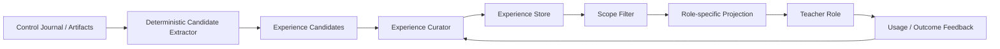

# 经验系统

可以。先给出核心判断：经验系统不应只是“历史摘要库”，而应是一个有证据、有适用范围、可修正、按角色投影的跨 Run 学习系统。

你提出的“下游角色打回上游角色”是非常有价值的触发信号，但更适合触发“经验候选”，不能直接生成长期有效经验。一次打回可能来自偶发格式错误、API 故障、单案例误判或 Reviewer 自身错误，直接固化会形成错误自我强化。

另外需要注意现有术语：`CONTEXT.md` 已将经过确认、可跨 Evolution Run 复用的结论定义为 `Research Experience`，未经审查的内容不能叫正式经验。因此建议区分：

```
Control Event / Artifact
        ↓
Experience Candidate（待归纳、待确认）
        ↓
Experience Curator
        ↓
Research Experience（可复用经验）
        ↓
Role-specific Experience Projection
        ↓
Teacher Role
```

## 一、经验系统究竟解决什么问题

经验系统至少服务五个目标：

1. 避免重复探索已经失败、被证伪或已确认不适用的方向。
2. 让上游角色知道自己的输出曾如何导致下游无法执行。
3. 逐渐建立 Student、Hook Model 和 Teacher Role 的行为画像。
4. 复用成功方法，但同时保留适用边界和反例。
5. 跨 Generation、跨 Evolution Run 继承研究认识，而不必重新阅读完整历史 artifact。

它不应承担以下职责：

- 不能替代当前 Trial、Conformance 或 Candidate Evaluation 的证据。
- 不能直接决定 Promotion。
- 不能因为历史失败就禁止再次尝试。
- 不能把完整轨迹长期塞入所有角色 prompt。
- 不能把一次成功自动解释为通用机制。

最重要的原则可以概括为：

> 经验用于提示“应该关注什么、曾发生什么、哪些方向值得或不值得重试”；当前证据负责证明“这次是否成立”。

## 二、经验应分成哪些类

我建议采用五类，而不是把所有内容写进一个“大经验摘要”。

### 1. Student Behavior Experience

记录 Student Agent 的稳定行为特征，例如：

- 缺少直接证据时倾向猜测、放弃还是继续检索。
- 对哪种反馈措辞响应稳定。
- 工具调用、结构化输出、多步搜索方面的表现。
- 哪些错误模式跨多个 Example 重复出现。
- 某种 Harness Intervention 对它是否容易生效。

这里必须特别区分：

- `Student Model`：模型本身。
- `Student Agent`：Student Harness + Student Model。

从普通 rollout 观察到的行为，默认只能归因于 Student Agent。只有独立模型 probe 或跨多个 Harness Version 的对照证据，才能归因于 Student Model 本身。

同理，Hook Model 应有独立画像，不能混入 Student Profile。

### 2. Intervention / Mechanism Experience

记录一种研究方向已经验证到什么程度：

- 针对的失败模式。
- 尝试过哪些 hypothesis、phase 和 intervention。
- 哪些正例有效。
- 哪些负例正确不触发。
- 哪些边界尚未覆盖。
- 哪些表达方式或 evaluator 不稳定。
- Distiller 最终形成了什么范围的 Mechanism。
- 哪些变体已经被证伪。

这是 Researcher、Evidence Reviewer 和 Distiller 最重要的历史输入。

### 3. Role Collaboration Experience

记录上游输出如何导致下游角色打回，也就是你最初提出的部分。

例如：

```
producer: Mechanism Distiller
consumer: Compiler
failure_layer: ambiguous_spec
observation: decision_contract 没有定义 uncertain 时的具体动作
correction: Distiller 必须为每个 label 提供 phase-local action
boundary: 只涉及多标签 evaluator，不涉及固定布尔规则
```

典型关系包括：

- Evidence Reviewer → Hypothesis Researcher
- Mechanism Distiller → Evidence 阶段
- Compiler → Mechanism Distiller
- Candidate Validation → Compiler
- Conformance Reviewer → Evidence / Distiller / Compiler
- Candidate Reviewer → 前述不同职责层

这类经验解决的是“角色协作协议虽然形式合法，但语义不足”的问题。

### 4. Implementation / Runtime Experience

记录经验性的工程约束，例如：

- 某 Hook Model 对复杂多条件 predicate 的结构化输出不稳定。
- 某种上下文投影会漏掉决定性输入。
- 某类 workspace 修改容易造成 manifest 与文件不一致。
- 某 API 兼容端点不支持特定 structured tool calling 形式。
- Compiler 常见的解析、状态、phase 或 fallback 实现错误。

稳定且已经成为正式接口的内容应进入 Reference 文档，而不是永久停留在经验库。经验系统只保存尚未固化、依赖运行环境或通过实验观察到的“工程事实”。

### 5. Attempt Outcome / Tried Direction

这是“已尝试思路”的结构化账本：

- direction fingerprint
- hypothesis / mechanism 摘要
- 父版本与 Student/Harness 范围
- 使用了哪些案例
- 走到哪个阶段
- 最终是 accepted、rejected、refuted、budget exhausted 还是 superseded
- 拒绝原因
- 什么条件变化后值得重试

它主要用于防止重复走完全相同的路线。

这部分很多内容可以从 Control Journal 和 artifact 确定性生成，不必全部由模型总结。

## 三、不同角色是否应访问不同经验

应该不同。这不是权限保密问题，而是相关性和认知污染控制。

| 角色                  | 主要可见经验                                                 | 应限制的内容                                   |
| --------------------- | ------------------------------------------------------------ | ---------------------------------------------- |
| Failure Analyst       | Student 行为画像、历史失败模式、已探索方向                   | 不应直接告诉它“应该采用某机制”                 |
| Hypothesis Researcher | Student/Profile、方案谱系、已证伪方向、Researcher 协作经验   | 不把旧经验当作当前假设的证据                   |
| Intervention Worker   | 当前 assignment、执行工具注意事项、明确 runtime 限制         | 默认不读取历史结论，防止偏离 frozen hypothesis |
| Trial Reviewer        | Trace 解释经验、Student 行为背景、已知混淆因素               | 历史成功不能替代当前 Trial 观察                |
| Evidence Reviewer     | 证据冲突模式、历史边界、Reviewer 校准经验                    | 不能用历史经验补足当前 coverage                |
| Mechanism Distiller   | 机制边界、历史反例、可操作定义缺陷、Hook Model 表现          | 不读取具体代码修补方案来反向扭曲机制           |
| Compiler              | Runtime/API/Hook 实现经验、过往实现失败、Hook Model 画像     | 通常不需要高层 Student 研究叙事                |
| Conformance Reviewer  | 历史 replay 风险、evaluator/parsing/state/action 失败模式    | 经验只能提示检查点，不能决定 verdict           |
| Candidate Reviewer    | Student 画像、历史 regression、相似 Candidate 结果、成本特征 | 仍必须基于当前 evaluation 作判断               |

当前只有 `CandidateReviewerInput.historical_experience` 预留了历史经验字段，而且调用方始终传入空列表：[contracts.py (line 894)](/D:/_Project/Agent/search_harness/search_harness/evolution/research/roles/contracts.py:894)、[research_role_effects.py (line 246)](/D:/_Project/Agent/search_harness/search_harness/evolution/control/research_role_effects.py:246)。因此当前并不存在真正的经验分发机制。

## 四、什么时候触发经验归纳

建议分成“候选捕获”和“正式归纳”两层。

### 1. 立即生成 Experience Candidate

以下事件发生时，Controller 可以确定性生成经验候选：

- Reviewer 将工作打回上游。
- Compiler 返回 `needs_evidence` 或 `needs_mechanism_revision`。
- Candidate Validation 失败。
- Conformance 将问题归因到 evidence、mechanism 或 implementation。
- Candidate 被拒绝。
- Research Attempt 因预算、证伪或不可蒸馏而结束。
- Candidate Promotion 成功。
- 同一个 failure fingerprint 重复出现。

候选只包含已经存在的结构化事实：

```
谁打回谁
route
failure_layer
obligation
当前 hypothesis/mechanism/candidate fingerprint
artifact refs
scope
```

此时不必再次读取完整轨迹。

### 2. 在结算点执行正式归纳

更适合调用 Experience Curator 的时间点是：

- Research Attempt 结束。
- Candidate 被接受或最终拒绝。
- Generation 结束。
- 同类候选累计达到合并阈值。
- 新证据与已有经验发生矛盾。
- Accepted Template Version 改变，需要重新评估画像适用范围。

不建议每次 Work Item 完成就调用总结模型，成本高且会生成大量碎片。

### 3. 对“打回即总结”的具体判断

不同打回价值不同：

| 打回原因                           | 是否立即生成候选 | 是否能立即成为正式经验                                    |
| ---------------------------------- | ---------------- | --------------------------------------------------------- |
| 明确 capability/spec mismatch      | 是               | 通常先 provisional                                        |
| Conformance 给出清晰 failure layer | 是               | 重复出现后确认                                            |
| Candidate Evaluation regression    | 是               | 可形成强结果经验，但范围仍受当前样本限制                  |
| API 超时或临时网络错误             | 否               | 否                                                        |
| JSON 格式偶发失败                  | 记录运行指标     | 重复稳定出现后才形成角色经验                              |
| Worker assignment 不合适           | 通常不单独记录   | 多次同类 mismatch 后记录                                  |
| Promotion 成功                     | 是               | 可确认“本 Candidate 有效”，但不能直接确认所有机制因果主张 |

## 五、如何撰写经验

推荐固定使用：

```
观察 → 解释 → 边界 → 行动
```

例如：

```
观察：
在 qwen3-8b 与当前 Hook Model 配置下，三个复杂 multi-condition
predicate probe 中有两个出现缺字段或标签不一致。

解释：
当前证据不支持把自由文本多条件 predicate 当作稳定 evaluator。

边界：
尚未测试单条件 predicate；该结果不说明 Compiler 的代码生成能力不足。

行动：
Researcher/Distiller 应优先提出字段少、可直接观察的 predicate；
Compiler 仍须执行 Hook evaluator probe。
```

写作规则：

- 一条经验只表达一个主张。
- 必须区分观察事实和推断。
- 必须写 `does_not_cover` 或未知边界。
- 必须包含具体可执行建议。
- 不使用“总是、绝对、必然”等过宽表述。
- 不把单个案例名称写成通用规律。
- 不把 Reviewer 的意见伪装成事实。
- 不使用无来源的置信度数字。
- 正文应紧凑；完整轨迹只通过 artifact ref 按需读取。

## 六、最小有效 Experience Card

建议最小字段为：

```
id
kind
status
scope
claim
observation
action
does_not_cover
supporting_refs
contradicting_refs
source_roles
fingerprint
created_at
last_confirmed_at
```

字段职责：

- `kind`：Student 行为、机制边界、角色协作、实现运行或尝试结果。
- `status`：建议先只支持 `provisional / confirmed / contradicted / superseded`。
- `scope`：Student/Hook Model、Template Version、runtime、任务族和 phase。
- `claim`：可复用的单一结论。
- `observation`：从 artifact 中得到的事实。
- `action`：后续角色应如何利用该经验。
- `does_not_cover`：明确没有证明什么。
- `supporting_refs`：支持该经验的 artifact。
- `contradicting_refs`：反证或冲突。
- `source_roles`：经验从哪些角色关系产生。
- `fingerprint`：去重和合并键。
- 时间字段：用于新旧比较，而不是按时间自动删除。

不建议第一版加入浮点 `confidence`。它通常是假精确；状态、distinct case 数量、支持/反证引用更可靠。

## 七、经验状态、去重和过期

状态转换建议是：

```
provisional
  ├─ 新的独立支持 → confirmed
  ├─ 新的反证     → contradicted
  └─ 更准确条目   → superseded
```

时间本身不应删除经验。真正导致经验不再适用的是：

- Student Model 或 Hook Model 更换。
- Template/Harness 行为发生相关改变。
- Runtime/API 版本变化。
- 任务族不匹配。
- 新证据反驳。
- 新条目提供了更精确的范围。

去重先用结构化条件：

```
kind
+ scope
+ producer_role / consumer_role
+ failure_layer
+ mechanism/direction fingerprint
+ tags
```

再由 Curator 决定：

```
append evidence
merge
keep separate
contradict
supersede
```

第一版不需要 embedding。先做字段过滤、标签和全文检索，通常已经够用；等经验量真正增长后再考虑向量检索。

## 八、推荐的整体架构

````

````

关键约束：

- Experience Store 应跨 Evolution Run 存在。
- 每个 Work Item 实际使用了哪些经验，必须固化为 `experience_refs` 和 projection digest，保证复现。
- Store 后续更新不能改变已经开始的 Role Session 输入。
- Role 只能读取投影，不应自由扫描整个 Store。
- Curator 只能写经验，不能修改 Template 或改变 Controller 路由。
- Controller 可以使用确定性的 Attempt fingerprint 防止完全重复，但不能把语义经验直接变成不可绕过的门禁。

## 九、相关工作的启示

Terra 子代理重点调研并由我复核了三类实现：

- A-Evolve 将最小 episodic memory 与可复用 skill 分开，并通过 Curator 执行 `ACCEPT / MERGE / SKIP`，这一分层很值得采用：[guided-synth.md (line 1)](/D:/_Project/Agent/search_harness/research/a-evolve/docs/algorithms/guided-synth.md:1)。
- Argus 的失败经验同时保存事实结果、claim boundary、retry condition 和 artifact refs，非常接近本项目需要的失败经验卡：[failure_experience.py (line 45)](/D:/_Project/Agent/search_harness/research/Argus-main/argus_skill/life/failure_experience.py:45)。
- AgentSquare 主要按相似度检索成功轨迹，缺少证据等级、过期和反证治理，可借鉴“摘要检索、正文延迟读取”，但不能照搬其经验可信机制：[memory_modules.py (line 9)](/D:/_Project/Agent/search_harness/research/agent-square/modules/memory_modules.py:9)。

## 十、建议的最小落地顺序

第一阶段只实现三件事：

1. `Attempt Ledger`：确定性记录已尝试方向、fingerprint 和终态。
2. `Experience Candidate`：在语义打回、Candidate 结算和 Promotion 时生成。
3. 为 Researcher、Distiller、Compiler 提供受控的角色经验投影。

第二阶段再增加：

- Experience Curator 的合并与状态更新。
- Student/Hook Model Profile。
- Conformance/Candidate Reviewer 风险经验。
- 跨 Run Experience Store。
- 经验使用效果反馈。

暂时不建议：

- 全角色共享同一 memory。
- 每个 Work 后都调用总结模型。
- 一开始就加入向量数据库。
- 让经验自动改变 Promotion Gate。
- 自动把成功 Candidate 转换成无条件规则。

我认为下一步最需要一起确定的是两个问题：

1. `Student Profile` 是正式持久化对象，还是由 Student Behavior Experience 动态生成的投影？我倾向后者，避免维护第二份事实来源。
2. 第一版 Experience Curator 是独立 Teacher Role，还是一个结算阶段的内部辅助角色？我倾向独立角色协议、由 Controller 在结算点调用，但不让它进入研究决策路由。
