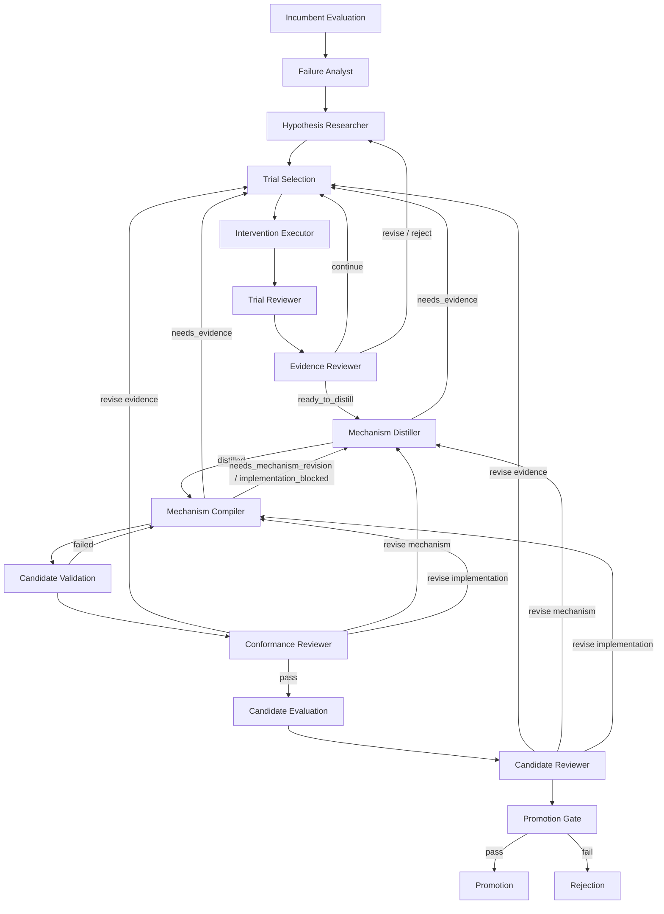

# 当前 Teacher Roles 代码分析

## 0. 审计范围与结论

本文描述 `main` 分支提交 `8e1121fe4778` 之后当前工作区所对应的 Teacher Role 实现。审计日期为 2026-08-06。

本文是代码快照分析，不是新的规范来源。统一术语以[项目语境](../../CONTEXT.md)为准，稳定角色协议以 [Teacher Role Contracts](../reference/role-contracts.md) 为准，Controller 主流程以 [Evolution Architecture](../architecture/evolution.md) 为准。本文没有重新执行真实 Teacher API，因此不据此评价模型效果或服务稳定性。

当前实现具备九个闭集 Teacher Role、共享 Manifest/Assembly、严格结构化协议、资源访问账本、可恢复 Hypothesis Researcher Role Session、专用多 phase Intervention Runtime、Candidate Validation、Conformance Review 和 Candidate Review。正式 Evolution Controller 的普通角色默认由 `NativeChatRoleRunner` 执行；`AgentsSdkRoleRunner` 是可用的独立执行适配器，但不是 Controller 当前默认路径。

本次静态审计识别出两个值得后续处理的实现差异：

1. `NativeChatRoleRunner.continue_reviewer()` 已实现，正式 Controller 当前没有使用；每次 Evidence Review 都创建新 Role Session。
2. Mechanism Distiller 的 prompt 要求检查 trial 并引用支持证据，但程序没有强制读取 trial，也没有把 `MechanismSpec.evidence_refs` 与已附加 trial 集合交叉校验。

Candidate Reviewer 另有两个明确的能力边界：Harness diff 检查只由 prompt 要求，没有程序访问门禁；`historical_experience` 在当前 Controller 中固定为空，因此 Research Experience 尚未接入该角色。

## 0.1 角色闭集与协议版本

| 规范角色 | 当前内部 ID | Role contract | Output contract | 正式 Controller Runtime |
| --- | --- | --- | --- | --- |
| Failure Analyst | `failure_analyst` | `@1` | `failure_direction@1` | Native Chat |
| Hypothesis Researcher | `hypothesis_researcher` | `@1` | `intervention_hypothesis@5` | Native Chat + Role Continuation |
| Intervention Executor | `intervention_worker` | `@1` | `intervention_worker_result@4` | Persistent Intervention Branch |
| Trial Reviewer | `trial_reviewer` | `@1` | `trial_review@2` | Native Chat |
| Evidence Reviewer | `evidence_reviewer` | `@1` | `evidence_review@2` | Native Chat |
| Mechanism Distiller | `mechanism_distiller` | `@1` | `mechanism_distillation@2` | Native Chat |
| Mechanism Compiler | `compiler` | `@1` | `compiler_result@2` | Native Chat |
| Conformance Reviewer | `conformance_reviewer` | `@1` | `conformance_review_batch@5` | Native Chat |
| Candidate Reviewer | `candidate_reviewer` | `@1` | `candidate_review@2` | Native Chat |

`intervention_worker` 和 `compiler` 是当前稳定内部 ID，不应在面向领域的叙述中替代 Intervention Executor 和 Mechanism Compiler。

## 0.2 当前路由图



Trial Selection、Evaluation、Candidate Validation、Promotion Gate、Promotion 与 Rejection 都是确定性机制，不是 Teacher Role。

## 0.3 公共装配与普通 Role Runtime

除 Intervention Executor 外，当前正式流程共用以下路径：

1. `TeacherResources.from_config()` 只加载显式声明的 Evaluation、Trial、Mechanism Compiler、Intervention 或 Candidate Comparison 资源。
2. `load_teacher_agent_spec()` 通过共享 Manifest 和 Assembly 加载 Prompt、Output 与显式 Tool Component。
3. Role Input 先由对应 Pydantic 类型校验；所有 Teacher payload 都配置 `extra="forbid"`。
4. `TeacherResources.bind_role_input()` 根据已验证输入收窄证据范围或绑定 capability packet。
5. Prompt Component 将 Role Input 和紧凑 resource context 渲染为用户消息。
6. `NativeChatRoleRunner` 使用 `TEACHER_*` OpenAI-compatible 原生工具循环，并动态增加 `submit_<output_contract_id>` 终态工具。
7. 终态参数先经过 Pydantic 校验，再经过 `validate_role_output()` 的资源义务校验。失败会作为工具错误留在同一 Role Session，允许模型修正。
8. 合法输出写入统一 Role Artifact；Control Effect 只把小型 outcome、Artifact Reference 和 token usage 返回 Controller。

统一 Role Artifact 当前为 schema v1，包含角色/输出协议身份、Schema digest、模板根、Runtime、非秘密模型 provenance、实际 Role 预算、输入、资源配置、输出、已验证机制、资源产物、Tool Call、usage 和 transcript。Native Chat 还增加 `role_session`，其中保存 session ID、revision、资源访问状态、输出历史与反馈历史。每个活动角色从 `config/runtime.yaml` 的 `teacher_roles.<role_id>` 独立读取 `max_tokens` 与 `max_turns`。

原生工具循环耗尽时，Runner 抛出携带失败 artifact 的结构化异常；Controller 在失败
Work 目录持久化 `<role_id>.failed.json` 后才记录 `work_failed`。该 artifact 保留完整
部分 transcript、工具调用、usage、回合数和逐轮 `finish_reason`，因此失败调用也可审计。
终态契约校验会返回字段路径、实际长度和最大长度；若连续提交出现相同字段错误，反馈
明确要求保留决策与合法字段，只修复错误字段，不自动截断角色语义内容。

独立 `AgentsSdkRoleRunner` 重用相同装配、资源和后处理，可选择 terminal tool 或 SDK native structured output。它不会持久化 Native Chat 的 Role Session 状态，也没有 `continue_researcher()`；因此“能执行相同 Role contract”不等于与正式 Controller 的恢复语义完全可替换。

## 0.4 Role Session 与 Continuation

`RoleSession` 是角色无关的会话状态：`session_id`、`revision`、messages、output history 和 feedback history。Continuation 会校验角色、模板根、初始输入、资源配置与首条 system instruction 未发生不允许的变化，并恢复证据读取账本。

正式 Controller 当前只调用 `continue_hypothesis()`：

- Intervention Executor 或 Evidence Reviewer 的反馈作为新的 user message 追加。
- 原 Hypothesis Researcher 的 transcript、session ID 和已检查 trajectory/capability 状态得到恢复。
- 新 trial 文件可以追加到资源配置，但其他资源边界不能变化。

`continue_reviewer()` 虽已支持向 Evidence Reviewer 追加新 Trial Review 和 aggregate observations，当前 `EvidenceReviewEffects` 没有调用它，而是复用已有 Trial Reviewer artifact 后创建新的 Evidence Reviewer Role Session。

---

## 1. Failure Analyst

### 1.1 激活与路由

Incumbent Evaluation 完成后，Controller 无条件创建 `analyze_failure` Work Item。任何合法 `FailureDirection` 都进入 Hypothesis Researcher；角色输出不直接决定其他路由。Role invocation 失败由 Controller 的通用 Work Retry 处理。

### 1.2 输入与输出

输入只有可选 `analysis_focus`，最长 300 字符。Controller 当前从 Work Item payload 读取它；默认通常为空。

输出 `FailureDirection`：

| 字段 | 约束与职责 |
| --- | --- |
| `pattern` | 1–400 字符；一个可观察的 Student 失败行为序列 |
| `applicability` | 1–300 字符；模式适用边界 |
| `caveats` | 1–3 项；未解决混杂因素或诊断限制 |
| `evidence_refs` | 2–4 个唯一 `example_id/replicate_id` 引用 |

### 1.3 资源与工具

角色获得 incumbent Evaluation Report、Rollout JSONL 和当前 Student Template：

- `list_evaluation_cases`
- `list_evaluation_cases_by_cost`
- `get_cost_summary`
- `get_evaluation_case`
- `get_student_trajectory`
- `get_harness_manifest`

资源层把唯一 trajectory 读取预算固定为 6。初始上下文故意不提供成本详情；成本工具只在效率是合理分析方向时按需使用。

### 1.4 Prompt 与程序门禁

Prompt 位于 `harness_templates/teacher/failure_analyst/prompt/`。其核心约束是诊断而非求解：不得提出 Hook phase、提示词、查询策略、答案或代码修改；应区分 Student 行为、Runner/Tool failure、语料不足与评分歧义。

程序要求输出中的每个 `evidence_ref` 都已通过 `get_student_trajectory` 成功读取。它不强制至少检查两个不同 Example；“尽量跨两个案例”仍属于 prompt 义务。`caveats` 只限制列表长度，没有为每个元素声明非空字符串约束，这是当前协议的一个较弱点。

### 1.5 当前判断

该角色的数据访问和引用闭环较完整：模型不能引用未打开的 trajectory，且证据预算明确。主要剩余不确定性是“行为模式是否足够一致”仍由模型判断，程序只验证引用存在，不验证多案例覆盖或 pattern 与 Evidence 的语义一致性。

---

## 2. Hypothesis Researcher

### 2.1 激活与路由

首次由合法 Failure Direction 激活。Evidence Reviewer 的 `revise` 或 `reject` 会续接原 Role Session，而不是创建新研究会话。

合法 `InterventionHypothesis` 会重置 trial/assignment 计数并进入 Trial Selection。Hypothesis revision 受 `max_hypothesis_revisions` 限制。

### 2.2 输入与输出

输入 `problem_direction` 是完整 `FailureDirection`。

输出 `InterventionHypothesis`：

| 字段 | 约束与职责 |
| --- | --- |
| `fork_phase` | `post_prompt`、`post_model`、`post_parse`、`pre_tool`、`post_tool` 或 `pre_final` |
| `phase_plan` | 1–4 个 phase 唯一的 directive，第一项必须等于 `fork_phase` |
| `phase_plan[].activation_condition` | 当前 phase 可观察条件 |
| `phase_plan[].instruction` | 临时 Intervention 意图 |
| `phase_plan[].expected_effect` | 立即可观察的 Student 行为效果 |
| `phase_plan[].max_activations` | 1–4 |
| `evaluation` | primary signal、success condition、falsifier 和最多 3 个 secondary metric |
| `applicability` | 假设适用边界 |

### 2.3 资源与工具

Researcher 只能读取 Failure Analyst 引用的 trajectory；golden answer 会从受限视图移除。工具为：

- `get_student_trajectory`
- `get_intervention_capabilities`
- `list_trial_evidence`
- `get_trial_evidence`

首次运行通常没有 trial。Continuation 可以附加已经发生的 trial，让 Researcher 在反馈不足以定位问题时读取完整 source/branch Evidence。

### 2.4 Prompt 与程序门禁

Prompt 位于 `harness_templates/teacher/hypothesis_researcher/prompt/`。它允许一个短的多 phase 因果链，但禁止把无关实验捆绑在一起，也禁止 case answer、实体、专用 query、代码和未声明 Runtime 能力。来自 Evidence Reviewer 的续接指令由 `prompt/continuations/` 下的独立模板提供，结构化反馈由 Runtime 注入，不再硬编码于 Native Chat Runner。

提交前程序要求：

1. Failure Analyst 引用的全部 trajectory 都已读取；
2. `get_intervention_capabilities` 已调用；
3. phase plan 的唯一性和首 phase/fork 一致性通过协议校验。

### 2.5 当前判断

Role Continuation 已形成真正的研究延续语义：反馈、输出历史和资源读取账本都可恢复。程序能阻止 Researcher 跳过原始 Evidence 或凭空选择 phase。它仍不能验证 activation condition 是否真的只依赖 capability catalog 中的字段；该语义义务后续由 Trial Review 和 Distillation 再审查。

---

## 3. Intervention Executor

### 3.1 激活与路由

确定性 Trial Selection 优先遍历 Failure Direction 的 Evidence 引用，再遍历其余 Rollout，选择第一个尚未使用、且包含 `fork_phase` 的 Trajectory Prefix。选中后激活 Intervention Executor。

当前输出路由：

- `executed`：trial 计数加一，进入 Trial Reviewer 与 Evidence Reviewer。
- `unsuitable_assignment`：在 assignment 预算内重新选择 prefix。

### 3.2 输入与输出

输入包括冻结 Hypothesis、由 primary signal/success/falsifier/先前义务拼成的 `trial_objective`、Example/Replicate、`prefix_id` 和 prohibited content。

程序生成的 `InterventionWorkerResult` 只报告执行事实：

- `result_kind`
- `activated_phases`
- `modified_phases`
- `unmet_phases`

`executed` 必须至少有一个 activated phase；modified 必须是 activated 子集；activated 与 unmet 不得相交。已到达 phase 但未修改上下文的结果仍是可审查的负对照 Trial。

### 3.3 专用 Runtime 与动态工具

该角色不走公共终态输出循环。`InterventionRoleRunner` 验证 prefix phase 与 Hypothesis 一致，然后使用 `activation_system.md` 创建一个跨所有配置 phase 持久存在的 Teacher transcript。Student 从包含当前 phase 的 inclusive prefix 分支继续。

每次 Hook activation 动态提供：

- `inspect_editable_context`：只列出数字 ID、类型、角色、字符数和短摘要
- `inspect_context_block`：按数字 ID 读取单个块的完整 Student-visible 内容
- `apply_context_patch`：原子执行有序的 insert/replace/delete 操作
- `defer_final_answer`，仅 `pre_final` 可用
- `accept_final_answer`，仅 `pre_final` 可用
- `continue_without_change`

其中 inspect 工具不是终态；其余动作工具是终态。`apply_context_patch` 在实时分支中只于 `post_prompt`、`post_tool` 提供；其他 phase 使用对应的结构化控制动作或 no-op。每次 activation 必须调用一个 terminal action；调用后立即把控制权还给 Student。`block_id` 是当前投影中的纯数字顺序编号。程序内部负责把编号映射回消息或当前工具结果，并保留 ToolResult metadata 等不可编辑状态；Worker 不查看也不填写这些 metadata。patch 只改变下一次 Student generation 的可见上下文。phase-local activation budget 由 Hypothesis 直接传入 Runtime。

### 3.4 Prompt 与实际装配差异

Manifest 中的 Prompt Component 指向 `prompt/system.md` 和 `prompt/user.md`；专用 Runner 只使用装配结果中的 Manifest/Role identity，实际 activation instruction 来自同目录的 `prompt/activation_system.md`。Manifest 的 tools 为空，因为可用工具由当前 phase 动态构造。

Prompt 的关键安全规则是不得使用 golden answer、隐藏证据或未出现在已检查 Student-visible block 中的信息。Worker 可以在干预本身要求时，对已检查块做有依据的选择、重排、改写或摘要，但不得把 Teacher-only 推理写入 Student context。它只能通过有界动作改变 Student，不得启动嵌套 Agent Loop 或执行 Student Tool。

### 3.5 程序产物与门禁

Role Output 不是模型自报，而是程序从 activation counts 和 intervention changes 计算。完整 trial artifact 保存 source、phase plan、budgets/counts、context changes、phase effects、branch run、comparison 和 worker trace。

当前 `_worker_result()` 只会产生：

- 任一计划 phase 已到达时为 `executed`；即使所有动作都是
  `continue_without_change`，也保留为可审查的负对照 Trial；
- 所有计划 phase 均未到达时为 `unsuitable_assignment`。

Worker 协议因此只有 `executed` 与 `unsuitable_assignment` 两态：前者报告已到达分支上的执行事实，后者只表示所分配 prefix 未到达任何计划 phase。程序能检测 action 是否发生，却不在这里判断 action 是否忠实、泄漏、支持假设或暴露了能力边界；这些归因职责交给 Trial Reviewer 和 Evidence Reviewer，必要时再由 Evidence Reviewer 续接 Hypothesis Researcher。

早期真实 API 定点改写验证中，Worker 能按 `inspect_editable_context → inspect_context_block(1) → apply_context_patch` 完成动作，但文本工具协议曾混合自定义 `<tool_call>` 与 DeepSeek V4 原生 DSML，造成闭合标签漂移、纯 DSML 重复和 completion token 耗尽。Schema-first parser 只能恢复已经存在完整 JSON 的输出，不能恢复模型根本没有生成动作参数的情况。

当前实现已删除 Intervention 专用文本 parser，改为与其他 Teacher Role 一致的 API 原生 structured tool calling。专用 Runner 仍负责 Student/Teacher 交替运行和跨 phase session；每个 activation 的动态 ToolSet 通过 `tools` 参数发送，只有 Provider 返回的 `message.tool_calls` 会被执行。无结构化调用的正文保留在 `worker_trace`，但不会写回 session；这避免 DSML 或其他 Provider 内部标记形成自增强重试循环。终态 ToolResult 仍只回显动作名，完整 action 保留在审计 metadata 与 trial artifact。

迁移后的同一 Search-o1 改写输入并行真实执行 3 次，三次均通过原生调用完成 `inspect_editable_context → inspect_context_block → apply_context_patch`，Role Output 均为 `executed`、Student branch 均为 `completed`，模型正文中的 DSML 计数均为 0。三次各用了 5 个 Teacher request；其中一轮 response 并行携带两个只读 inspect 调用，Worker 按既有“每轮一个工具”约束为两个 call ID 返回错误后重试，没有执行部分调用或放宽 terminal 规则。三次最终都只替换 block 1，非 system block 由程序保持原顺序和内容。

---

## 4. Trial Reviewer

### 4.1 激活与路由

每次 `executed` Intervention Trial 都会先经过一个独立 Trial Reviewer。`EvidenceReviewEffects` 会复用与冻结 Hypothesis 和 trial ref 匹配的已有 Trial Review artifact，避免恢复时重复调用。

Trial Review 本身不直接路由；全部逐 trial 结果和确定性 aggregate observations 一起交给 Evidence Reviewer。

### 4.2 输入、输出和工具

输入包含冻结 Hypothesis 与唯一 `trial_ref`。输出 `TrialReview` 只有：

- `trial_ref`
- `assessment`，1–4000 字符

唯一显式工具是 `get_trial_evidence`。资源配置必须只加载被分配的那一个 trial；提交前必须读取完整 trial，输出引用必须与已加载引用完全一致。

### 4.3 Prompt 与程序边界

Prompt 位于 `harness_templates/teacher/trial_reviewer/prompt/`。它要求逐 phase 检查触发、动作时机、立即效果、泄漏、显式 score/cost 和 Runtime failure，不得跨 trial 判断整体 Hypothesis，也不得提出新 Intervention。

程序可以证明 Reviewer 打开了正确的完整 trial，不能证明 assessment 覆盖了 prompt 列出的每个维度。该角色输出是自由文本事实分析；结构化的 phase verdict 由下一层 Evidence Reviewer 产生。

---

## 5. Evidence Reviewer

### 5.1 激活与路由

至少一条 `executed` trial 完成逐 trial review 后激活。输出路由为：

- `continue`：在 trial 和 assignment 预算内返回 Trial Selection。
- `revise` 或 `reject`：增加 Hypothesis revision，并续接原 Hypothesis Researcher。
- `ready_to_distill`：进入 Mechanism Distiller。

这里的 `reject` 是对当前 Hypothesis 的 Evidence Review 结果，不等于 Candidate Rejection，也不会立即终止整个 Evolution Run。

### 5.2 输入与输出

输入：冻结 Hypothesis、程序聚合 observations、至少一条 Trial Review、可选
`prior_obligation`，以及程序计算的 trial/assignment 上限、已用数量、剩余数量和
`conclusion_required`。

输出 `EvidenceReview`：

| 字段 | 约束与职责 |
| --- | --- |
| `decision` | `continue`、`revise`、`reject`、`ready_to_distill` |
| `phase_findings` | 每个冻结 phase 一个 finding，顺序必须与 plan 相同 |
| `phase_findings[].status` | `supported`、`unsupported`、`not_reached`、`contaminated`、`inconclusive` |
| `assessment` | 总体判断 |
| `key_risk` | 可选风险 |
| `next_obligation` | `continue` 必填；终态 `reject/ready_to_distill` 必须为空 |

### 5.3 资源、Prompt 与门禁

该角色没有显式工具，也不直接读取 trial trajectory。它只看到独立 Trial Review 与程序 aggregate，避免重新执行逐 trial 角色职责。Prompt 位于 `harness_templates/teacher/evidence_reviewer/prompt/`，要求确定性 aggregate 与语义 assessment 冲突时以前者为准；新 Trial Review 的续接指令位于 `prompt/continuations/trial_reviews.md`。

`TeacherResources.validate_evidence_review()` 强制 `phase_findings` 完整覆盖冻结 phase，
并保持原顺序。这阻止模型遗漏困难 phase 或加入假设外 phase。当任一剩余调度预算为
零时，Prompt 要求从 `ready_to_distill`、`revise`、`reject` 中作出结论，资源门禁也会
拒绝 `continue` 并把验证错误返回同一 Role Session 修复。

### 5.4 当前判断

角色职责边界清楚，逐 trial 与跨 trial 判断已分离。当前 Controller 每次补充 trial 后会重新创建 Evidence Reviewer Role Session，虽然 `NativeChatRoleRunner.continue_reviewer()` 已支持真正的 Role Continuation。这不破坏输入完整性，但会丢失原 Reviewer 的对话推理上下文并增加重复 token；是否切换到 continuation 应作为控制语义和成本选择明确决定。

---

## 6. Mechanism Distiller

### 6.1 激活与路由

只在 Evidence Reviewer 返回 `ready_to_distill` 后激活。输出路由为：

- `distilled`：解析持久化 Mechanism Spec，进入 Mechanism Compiler。
- `needs_evidence`：在预算内返回 Trial Selection，并携带下一 Evidence Obligation；
  任一剩余调度预算为零时 Prompt 与资源门禁共同禁止该决定。
- `not_distillable`：本次 Evolution Run 以 Evidence 不可蒸馏结束。

Mechanism Compiler 的 `needs_mechanism_revision` 或 `implementation_blocked` 会把明确的 `next_obligation` 回流到新的 Mechanism Distiller invocation；`needs_evidence` 回到 Trial Selection。

### 6.2 输入与输出

输入包含冻结 Hypothesis、必须为 `ready_to_distill` 的 Evidence Review、完整结构化 Trial Reviews、程序维护的 coverage summary、trial refs、预算和 capability constraints。

终态 `MechanismDistillation` 只承担窄控制结果：

- `decision`
- `mechanism_ref`，仅 `distilled` 必填
- `rationale`
- `next_obligation`，`needs_evidence` 必填

真正的 `MechanismSpec` 由资源工具渐进构造并保存在 `validated_mechanisms`：goal、1–4 个 phase rule、behavioral pseudocode、state scope、expected behavior、Evidence refs、required capabilities、prohibited behaviors、observability 和 known limits。每条 phase rule 分别声明 deterministic guards、含 positive/negative/uncertain 边界与 evidence coverage 的 decision contract、decision inputs、runtime inputs、evaluator、positive action、三个 phase-local fallback 和 activation budget。

### 6.3 工具与 Prompt

工具为：

- `get_distillation_trial_detail`
- `create_mechanism_draft`
- `add_mechanism_phase`
- `complete_mechanism_draft`
- `set_mechanism_constraints`
- `run_student_model_experiment`
- `validate_mechanism_draft`

Prompt 位于 `harness_templates/teacher/mechanism_distiller/prompt/`。重点是把 Teacher Intervention 降为无需 Teacher 在线参与的最小 Mechanism，显式区分 deterministic guard 与 evaluator，要求模糊术语形成可操作的三值边界，并禁止用关键词/正则伪装语义判断。初始 Distillation Evidence Dossier 已按 Trial 对齐 Review、Student-visible mutation、phase effect 和 outcome；只有证据冲突时才下钻完整事件目录。对于 materially uncertain 的 `hook_model` 语义，Distiller 可使用正式 Student profile 运行自定义描述性实验；工具保留原始输出和 usage，不设置 expected label、匹配率或程序通过门禁。`runtime_inputs` 仍只选择受控 Topic，Compiler 负责最终集成。

### 6.4 程序门禁与缺口

程序确保：

- Mechanism Distiller 不能在输入 Review 非 `ready_to_distill` 时运行；
- Mechanism Distiller 接收冻结 Trial/Assignment 预算，预算耗尽时不能返回
  `needs_evidence`；
- `distilled` 必须引用本次 Role Run 中已经 Pydantic 校验的 Mechanism Spec；
- Student 模型实验是可选的描述性证据，不构成 `hook_model` phase 的提交门禁；
- phase 唯一、evaluator 值、activation budget 和主要文本字段满足协议。

但当前 `MechanismDraftStore.validate()` 只把模型提供的 `evidence_refs` 放入 Mechanism Spec 并做结构校验：

- 不要求 Mechanism Distiller 调用 `get_trial_evidence`；
- 不检查 Evidence refs 是否属于 `TeacherResourceConfig.trial_files`；
- 不检查引用的 trial 是否真的支持生成的每条 phase rule。

因此这里仍依赖 Prompt 纪律。建议后续把 Evidence 引用限制到 attached trial refs，并至少记录“已读取”义务；语义支持程度仍由 Evidence Reviewer 和 Mechanism Distiller 判断，不需要在程序中重复做模型判断。

---

## 7. Mechanism Compiler

### 7.1 激活与路由

获得已验证 Mechanism Spec 后激活。输出：

- `submitted`：进入 Candidate Attempt staging 和 Candidate Validation。
- `needs_evidence`：回到 Trial Selection；
- `needs_mechanism_revision` 或 `implementation_blocked`：在预算内回到 Mechanism Distiller；
- `submitted`：进入 Candidate staging。

Candidate Validation 失败会在 compiler revision 预算内创建一次新的 Mechanism Compiler invocation，并把 validation errors 作为 `validation_feedback` 输入。普通本次运行内的 deterministic validation error 应先通过 `finalize_candidate` 反馈就地修复。

### 7.2 输入与输出

输入：Mechanism Spec、Distiller 已保存的描述性 Student model experiments、
implementation constraints、validation feedback。

输出 `CompilerResult`：

- `decision`: `submitted`、`needs_evidence`、`needs_mechanism_revision` 或 `implementation_blocked`
- `candidate_ref`: `submitted` 必填，其他决定必须为空
- `implementation_summary`
- `unresolved_risk`
- `next_obligation`: 非提交决定必填

### 7.3 工具、capability packet 与可写边界

Manifest 当前显式注册：

- `list_harness_files`
- `read_harness_file`
- `query_hook_api`
- `run_student_model_experiment`
- `write_candidate_file`
- `delete_candidate_file`
- `finalize_candidate`

Role Input 绑定后，程序根据 Mechanism Spec 的受控 `runtime_inputs` 生成 source-derived capability packet v9，作为主要公开 API。模型视图用 Runtime Input Topic 的 Python-native 文档呈现已覆盖 symbols，只以紧凑 JSONL 补充未覆盖 contract；packet selection 不再重复 Mechanism 已提供的 guards、decision contract、fallback 和 activation budget。`query_hook_api` 默认返回 native reference 与最小来源/预算信息，结构化 contract 仍由底层 store 和 artifact 保留。初始上下文同时提供 manifest、evolution policy 和 Extension 索引；Compiler revision 直接收到续接 Candidate 的精确 changed file 内容。

`run_student_model_experiment` 允许 Compiler 在 prompt wording、response shape 或 per-request thinking mode 仍 materially uncertain 时执行有界 Student profile 实验。工具只返回原始输出、usage 和错误，不产生 expected label 或程序通过门禁；Distiller 已运行的实验通过 `CompilerInput` 直接继承，避免重复调用。

Mechanism Compiler 只能修改内存 Candidate Workspace。Evolution Policy 的 fixed Component、模板路径边界、Python 语法、Manifest/Assembly 和 Hook contract 由 Candidate Validation 与 deterministic source review 检查。Hook 校验既逐 Hook/phase 定位单体契约错误，也用全部 Candidate Hook 构造完整 Pipeline，并在同一 rollout state/store 中重复执行 tool-call、final-answer 和 error 生命周期，检查组合注册、共享状态、写权限、状态类型和重复调用的机械安全性；它不判断 Mechanism 语义。`finalize_candidate` 计算 diff、运行 deterministic review 和 Candidate Validation；失败返回 `repair_required`，通过才冻结 candidate ref。

### 7.4 Prompt 与程序后处理

Prompt 位于 `harness_templates/teacher/compiler/prompt/`。它把 behavioral pseudocode 视为控制流权威来源，要求逐 phase 保留 evaluator、budget、state hand-off 和 fallback；不得给 deterministic rule 偷加模型判断。

本轮修改后，`hook_model` 的边界进一步明确：

- `HookContext.call_model` 是 `decision_evaluator="hook_model"` rule 的必需 evaluator，不是可选增强；精确的 phase、类型、声明状态和 activation-budget guard 到达语义决策点后必须调用模型。
- 确定性代码只能检查公共 contract 提供的精确结构条件，不得把该 rule 的语义 predicate 移入关键词、子串、正则、分数或自行发明的 pre-filter。
- implementation constraint 若要求与声明 evaluator 冲突的语义 pre-filter，Compiler 应返回 `needs_mechanism_revision` 并指出冲突，不得静默改变 Mechanism Spec。

Hook 组织也改为明确的默认形状：

- 默认由一个 extension 返回一个实现完整机制的 Hook；只有机制明确要求独立注册组件，或复用既有 mutable 结构严格更小时，才选择多个 Hook，并在选择前说明理由。
- `handle()` 只负责 phase 路由；每个订阅 phase 的实际行为必须位于唯一的 `_handle_<phase>()` 私有方法中。
- 单 phase Hook 的 `handle()` 直接调用唯一 phase handler，不做冗余 phase 判断；多 phase Hook 显式按 `context.phase` 分派并在调用后返回。
- phase handler 不得再次检查已经路由的 `context.phase`。这些 handler 是强制组织边界，明确豁免“一次性 helper”禁令；其他一次性 helper 仍禁止。
- 共用一个 Hook 不得合并或重排各 phase 的 condition、action、evaluator、activation budget 或 state hand-off。

模型可见的组织模板为：

```python
def handle(self, context: HookContext) -> None:
    if context.phase == HookPhase.POST_TOOL:
        self._handle_post_tool(context)
        return
    if context.phase == HookPhase.PRE_FINAL:
        self._handle_pre_final(context)
        return

def _handle_post_tool(self, context: HookContext) -> None:
    ...

def _handle_pre_final(self, context: HookContext) -> None:
    ...
```

Compiler 的提交前 checklist 同步要求 `handle()` 只包含分派、每个 phase 行为位于对应 handler，且 handler 内不重复 phase 判断。

终态 `submitted` 后，`validate_role_output()` 要求 `candidate_ref` 能在本次 CompilerWorkspaceStore 中解析。Role Artifact 的 `resource_artifacts.compiler_candidate` 保存 parent/candidate digest、revision、validation、diff 和 changed files。Controller staging 会从 Accepted Parent Version 重新建立 Candidate Attempt，重放 changed files，并验证 digest 与 Compiler Artifact 完全一致。

### 7.5 当前判断

Mechanism Compilation 的机械闭环较强：模型不能只在终态粘贴代码，必须通过受控 workspace 得到可解析 candidate ref，Controller 还会在 Version Store 边界重复 Candidate Validation。仍由模型承担的是 Mechanism Spec 与代码的语义对应；这由后续 Conformance Review 补足。

Manifest 没有暴露 `show_candidate_diff`、`validate_candidate` 或分开的 `submit_candidate`，而采用合并的 `finalize_candidate`，与 Prompt 一致。公共工具工厂中仍保留这些未注册工具，但它们不属于当前 Compiler 模型可见能力。

---

## 8. Conformance Reviewer

### 8.1 激活与聚合

Candidate Validation 通过后，程序从所有 Intervention Trial 提取不同 Example，并在冻结
Evolution Set 中定位它们。每个 Example 固定执行 3 条 Candidate Student Rollout；同一
Example 的成功 Rollout 一次提交给 Conformance Reviewer，Runner error 则直接生成确定性
`runtime_error` Finding。Replay suite、Example Review Batch 和每条规范化 Finding 以
Candidate、Mechanism、Trial 与 Evolution Set 的内容摘要建立 checkpoint；Work 重试不重跑
已经完成的 replay 或 Review Batch。

聚合规则：

- 任意 `runtime_error` 或 `implementation_mismatch` 都是全局 hard failure；
- 每个 Example 至少一条 `faithful`；
- 同时满足时 decision 为 `pass`，否则为 `revise`；失败 Finding 的 Reviewer-owned `recommended_route` 决定回到 evidence、mechanism 或 implementation。

失败 Candidate 先持久化 Rejection，再在 candidate revision 预算内按聚合后的路由回流对应阶段。

### 8.2 输入与输出

输入包含 Mechanism Spec、该 Example 对应 trial refs、完整 reference observations、Example
identity 和有序的 lossless-for-conformance `candidate_trajectory_views`；共享证据只呈现一次，
每个 replicate 拥有明确的紧凑 JSON 边界。完整 replay 仍保存在 checkpoint，但不直接进入
模型上下文。每条 view 还提供 Hook-model profile、purpose、thinking mode、调用次数和基础
token 事实，供角色检查 Mechanism 明示的调用与成本边界。

模型输出 `ConformanceReviewBatch`，其中每个 replicate 对应一条 `ConformanceReview`：

| 字段 | 约束与职责 |
| --- | --- |
| `verdict` | `faithful`、`implementation_mismatch`、`not_observed`、`runtime_error`、`inconclusive` |
| `observed_phases` | 只允许 Mechanism Spec 中实际观察到的 phase |
| `assessment` | 实现保真判断 |
| `repair_obligation` | 非 faithful 必填；faithful 必须为空 |
| `failure_layer` | 非 faithful 的 projection/evaluator/parsing/state/action/integration/ambiguous_spec 分类 |
| `predicate_ref`、`expected_label`、`observed_label` | evaluator/parsing 诊断所需的三值判定信息 |
| `decisive_input_summary` | 不复制案例文本的决定性输入摘要 |
| `recommended_route` | `evidence`、`mechanism` 或 `implementation` |

模型只复制程序提供的 `replicate_id`。`candidate_run_ref` 与 `trial_refs` 是程序已知的路由
身份，程序严格校验 Finding 顺序并附加这些 identity，再持久化和聚合。

该角色没有工具，全部 Evidence 通过输入提供。Prompt 位于
`harness_templates/teacher/conformance_reviewer/prompt/`，明确禁止以答案正确性替代实现
保真，并要求 Reviewer 对每个 replicate 独立把 trace-visible decision inputs 判为 positive、
negative 或 uncertain：对应 fallback 正确才可视为 conformant；positive 被 Hook model、
解析、状态或控制逻辑送入 fallback 则是 `implementation_mismatch`；规格边界本身不足时标为
`ambiguous_spec` 并回到 mechanism。必须执行的 Harness action 与随后 Student effect 分开
判断，后续正确行为不能补偿 action 内容缺失。该判断不由确定性激活率门禁替代。

### 8.3 程序后处理

程序为模型输出附加权威 run/trial refs。若 Reviewer 返回 Mechanism Spec 之外的
`observed_phases`，会删除越界 phase；若原 verdict 是 `faithful` 且删除后无合法 phase，
则改为 `inconclusive` 并生成 repair obligation。清洗后的 Finding 是单条 checkpoint 的
`output`，也是 aggregate 的唯一输入；原始 Role artifact 只保存在 Example Batch
checkpoint，单条 Finding 通过 `role_artifact_ref` 引用，避免重复大体积 transcript。

### 8.4 失败恢复与用量

Example Batch 审查失败会持久化首条 Finding identity、失败阶段、完整 traceback、Role failure
artifact/部分 transcript 与已产生 usage。批次失败 artifact 汇总失败引用和 checkpoint 目录；
`work_failed.total_tokens` 计入 Control State。后续 Work retry 使用相同内容摘要，只重试尚未
完成的 Example Batch，成功 Effect 只上报本次新增 token，避免 replay 重跑、漏计和重复
计数。

---

## 9. Candidate Reviewer

### 9.1 激活与最终权限

Conformance pass 且完整 Candidate Evaluation 完成后激活。Candidate Reviewer 只给 Recommendation，不执行 Promotion。Controller 随后组合：

- Candidate Validation 必须通过；
- Candidate runner error 必须为 0 且指标可用；
- accuracy delta 不低于配置 safety floor；
- 配置成本门禁时 total token ratio 不超限；
- Reviewer recommendation 必须为 `accept`。

任一条件失败都进入 Rejection。Reviewer `revise` 只有在 candidate revision 预算内才会按 evidence、mechanism 或 implementation 回流；Reviewer `accept` 不能绕过 safety gate。

### 9.2 输入与输出

协议输入仍包含 Mechanism Spec、组合 validation summary、Mechanism Compiler implementation
summary、unresolved risk 和 `historical_experience`。模型可见的专用 brief 不重复呈现完整
Candidate Validation Report，只说明静态检查已通过，并呈现压缩 Conformance、一次
Incumbent/Candidate 指标对比、change landscape 与实现摘要。

底层组合 summary 保留：

- Compiler/Candidate Validation Report；
- 压缩 Conformance Summary；
- Incumbent metrics；
- Candidate metrics。

输出 `CandidateReview`：Recommendation、observed effect、reason，以及 `revise` 时必填的 next obligation 和 revision target。`accept/reject` 不得携带 revision 字段。

### 9.3 资源与工具

CandidateComparisonStore 要求 incumbent 与 candidate report 的 Example ID 集合完全一致。工具为：

- `list_candidate_changes`
- `get_candidate_case`
- `get_paired_student_trajectory`
- `get_candidate_harness_diff`
- `get_candidate_trajectory_text`

提交前程序要求至少读取一条 paired Student trajectory；若存在 improved 或 regressed Example，
必须分别覆盖至少一条相应 paired trajectory。Case 视图提供逐 replicate outcome、执行/token
delta 和 Hook activity 索引，帮助模型选择混合标签或真实变化的 replicate；完整语义仍需
trajectory 下钻。Harness diff 支持大文件按 path 展开，长轨迹文本支持按 event/field 精确
切片。

### 9.4 Prompt 与当前边界

Prompt 位于 `harness_templates/teacher/candidate_reviewer/prompt/`。它要求综合 Conformance、
准确率/稳定性、target cases、gain/loss、token 成本和 Harness diff，不使用隐含的
`accuracy_delta >= 0` 规则。Conformance Finding 在自身范围内仍是权威事实，但不自动证明
正向机制已稳定激活或产生收益；Reviewer 必须在检查的 target-relevant trajectory 中区分
合理 non-trigger fallback 与遗漏触发，fallback-only 证据不能被描述为正向机制已经观察到。
`revise` 还必须满足“单一 obligation 完成后，该 Candidate 不再遗留独立 reject 理由”；
否则直接 `reject`。

当前存在两个明确边界：

1. 程序强制 paired trajectory 覆盖，但不强制调用 `get_candidate_harness_diff`。因此“检查实现是否真的对应 Mechanism”仍是 prompt-only 义务。
2. Controller 构造输入时把 `historical_experience` 固定为 `[]`。字段和协议已经存在，但 Research Experience 尚未物化、检索或注入。

### 9.5 当前判断

Candidate Reviewer 已能判断“目标行为是否值得接受”，而 Promotion Gate 负责最低准确率和成本安全边界，两者职责不冲突。未来经验系统接入时，应把经过确认的 Research Experience 作为有来源、有限量的输入，而不是把历史自由文本直接填入 `historical_experience`。

---

## 10. 跨角色不变量

### 10.1 权限分离

- Teacher Role 只产生 Finding、Verdict、Recommendation、机制或候选提交，不直接修改 Control State。
- Evolution Controller 根据 Effect Receipt 和 Control Policy 提交 Transition。
- Candidate Reviewer 不执行 Promotion；Mechanism Compiler 不操作 Accepted Version；Intervention 不自动成为 Mechanism。

### 10.2 Evidence 范围

- Failure Analyst 只能引用已读取 trajectory。
- Hypothesis Researcher 只能读取 Failure Direction 引用，并必须全部读取。
- Trial Reviewer 只能读取被分配 trial，且提交前必须读取。
- Evidence Reviewer 不读取原始 trajectory，只消费逐 trial review 和 deterministic aggregate。
- Conformance Reviewer 只判断 Candidate 是否忠实实现 Mechanism，不判断答案质量。
- Candidate Reviewer 通过 paired Evidence 判断效果，不替代 Promotion Gate。

### 10.3 输出与恢复

- 普通 Role Output 由动态终态工具提交，Pydantic 和资源义务双重校验。
- Intervention Executor 的 Output 由程序从真实 branch 事件生成。
- Role Artifact 保存 output contract Schema digest，便于识别恢复时协议漂移。
- Hypothesis Researcher Continuation 要求模板 system instruction、角色身份和稳定输入一致。
- Controller 复用已经持久化的 Trial Review 与 Effect Receipt，不应为恢复重跑成功的外部调用。

### 10.4 Prompt 与程序门禁的区别

Prompt 负责不能完全形式化的语义纪律，例如“模式确实一致”“Intervention 没有泄漏”“Mechanism 只包含 Evidence 支持行为”。程序门禁负责引用、范围、类型、顺序、预算、状态转换和候选 digest。分析角色可靠性时必须分别检查二者，不能把 Prompt 指令写成已由程序保证的事实。

## 11. 审计关注项

| 优先级 | 关注项 | 当前影响 | 建议 |
| --- | --- | --- | --- |
| 中 | Conformance 清洗结果未回写单条 artifact | 单条 Evidence 与实际 aggregate/route 可能不一致 | 持久化 normalized Finding |
| 中 | Mechanism Distiller Evidence refs 无 attached-trial/读取校验 | Mechanism Spec 的证据谱系依赖 Prompt 纪律 | 限制引用集合并记录读取义务 |
| 中 | Candidate diff 读取不是提交门禁 | Reviewer 可能在未看实现差异时提交 | 若 diff 可用，记录并校验至少一次读取 |
| 低 | Evidence Reviewer Continuation 未接入 Controller | 重复上下文与 token；新会话不保留前次 Reviewer 推理 | 明确选择“全量重审”或接入 continuation |
| 信息 | Intervention Manifest prompt 与实际 activation prompt 分离 | 审计时容易误读 `system.md/user.md` 为真实执行提示 | 在模板 README 或 Manifest 注释能力中明确专用入口 |
| 信息 | `historical_experience` 恒为空 | Research Experience 尚未参与 Candidate Review | 等经验模型确定后接入，不填充未经确认文本 |

以上关注项不意味着当前闭环不可运行。它们主要影响证据一致性、恢复语义和角色行为可审计性，其中 Conformance artifact 与 Mechanism Distiller Evidence 谱系最值得优先处理。

## 12. 主要代码依据

- [Role 协议与版本](../../search_harness/evolution/research/roles/contracts.py)
- [Role 装配与后处理](../../search_harness/evolution/research/roles/role_execution.py)
- [正式普通 Role Runtime](../../search_harness/evolution/research/roles/native_chat_runner.py)
- [独立 Agents SDK Runtime](../../search_harness/evolution/research/roles/agents_sdk_runner.py)
- [Role Session](../../search_harness/evolution/research/roles/sessions.py)
- [Teacher 资源与访问账本](../../search_harness/evolution/research/resources/base.py)
- [Mechanism Compiler、Candidate 与 Intervention stores](../../search_harness/evolution/research/resources/stores.py)
- [内置资源工具](../../search_harness/evolution/research/tools.py)
- [Intervention 专用 Runner](../../search_harness/evolution/research/intervention/role_runner.py)
- [Intervention Executor 动态工具](../../search_harness/evolution/research/intervention/worker.py)
- [正式 Effect 装配](../../search_harness/evolution/control/effects.py)
- [普通研究角色 Effects](../../search_harness/evolution/control/research_role_effects.py)
- [Trial/Evidence Review Effects](../../search_harness/evolution/control/evidence_review_effects.py)
- [Conformance Effects](../../search_harness/evolution/control/conformance_effects.py)
- [Candidate Version Effects](../../search_harness/evolution/control/candidate_version_effects.py)
- [局部 Transition](../../search_harness/evolution/control/transitions.py)
- [Promotion Gate](../../search_harness/evolution/control/policies.py)
- Teacher Template：`harness_templates/teacher/<role_id>/`
