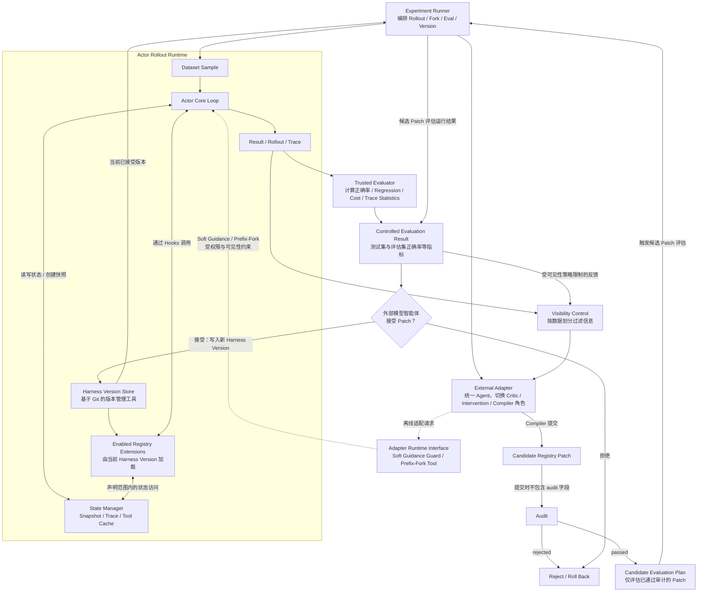

# 项目概览

## 文档职责

本文档说明 Search Harness 项目的研究目标、基本假设、范围边界和系统整体结构。

Actor、Adapter、评估与治理机制的具体设计分别记录在对应专题文档中。本文档只提供理解整个项目所需的共同背景。

## 项目定位

本项目研究一种面向小基础模型的 Search Agent Harness 自动适配机制。

在 Actor 模型、领域任务、基础工具环境和 Agent Core Loop 固定的前提下，外部强模型在离线适配阶段观察 Actor 轨迹、分析失败、尝试非题目相关的局部干预，并将稳定有效的干预模式转化为可部署的 Harness Extension。

这里的“离线适配阶段”指：不处于最终部署系统的实时推理路径中，但可以运行实验、回放轨迹、执行 Prefix-Fork、评估候选 Patch 的阶段。

最终部署系统仅包含：

```text
Small Actor Model
+ Actor Core Loop
+ Learned Registry Extensions
```

外部强模型不参与最终在线推理。

## 核心问题

本项目希望验证：

> 在不训练 Actor 模型、不修改 Agent Core Loop、且不依赖外部强模型在线参与的条件下，能否通过自动进化模型外部的 Harness，稳定提升小模型的 Search Agent 能力？

这里的 Harness 包括但不限于 prompt、tool、parser、validator、memory、workflow extension、controller policy、retry policy、schema repair 和 review gate。

## 研究假设

本项目基于以下待验证假设：

1. **小模型需要更强的外部结构支持。** 
   小模型在高自由度 Agent Loop 中容易出现工具调用不稳定、格式错误、搜索不足、过早回答和无法自我纠错等问题。模型外部的结构化支持可能缓解这些缺陷。
2. **不同模型可能需要不同的 Harness。** 
   不同基础模型在指令遵循、工具调用、上下文利用、反思和停止判断方面表现不同，因此适合它们的 Harness 也可能不同。
3. **外部强模型更适合离线发现结构。** 
   外部强模型的主要价值应是分析失败、探索干预方式并编译 Harness，而不是在部署阶段替小模型完成任务。
4. **有效的软干预可以被硬化。** 
   如果某类非题目相关的局部指导在多个样本、多个 Prefix 和多次采样中稳定有效，它可能被转化为 Prompt、Validator、Parser、Controller Policy 或 Workflow Extension。
5. **Registry Extension 可以逐步形成结构化流程。** 
   初始 Core Loop 不预设复杂工作流，而是通过可审计、可回滚的 Extension，逐步发现并固化小模型真正需要的约束。

## 第一阶段范围

第一阶段聚焦于可重复、可比较的受控实验环境：

- 使用 Controlled Corpus；
- 使用 Multi-hop QA 任务；
- 固定一个小模型作为 Actor；
- 固定基础 Search、Open、Read 类工具；
- 保持 Agent Core Loop 不变；
- 工具调用不产生外部副作用；
- 检索结果和工具输出可以缓存；
- 实验过程可以重复运行和比较。

第一阶段不直接使用开放网页搜索。开放网页的内容和检索结果可能发生变化，会降低 Prefix-Fork 和不同 Harness 版本之间的可比性。

## 非目标

第一阶段不以以下事项为目标：

1. 训练或微调 Actor 模型；
2. 构建开放 Web Search Deep Research Agent；
3. 构建通用 Agent 框架；
4. 让外部强模型参与最终在线推理；
5. 允许外部强模型直接修改 Agent Core Loop；
6. 允许外部强模型向 Actor 提供题目相关的 Query、实体、答案线索或证据路径；
7. 在第一阶段证明 Harness 对多个小模型普遍有效。

这些内容可能成为后续研究方向，但不属于第一阶段最小闭环的验收范围。

## 系统整体结构

系统由两个相互关联但职责不同的 Harness 组成。

### Actor Harness

Actor Harness 服务于小模型 Actor，负责提供完成 Search Agent 任务所需的运行时支持，包括：

- Agent Core Loop；
- Registry Extensions；
- State Manager；
- Search、Open、Read 等基础工具；
- Trace 与运行状态记录。

Actor Harness 是最终部署系统的一部分。部署阶段不得依赖外部强模型。

### Adapter Harness

Adapter Harness 服务于离线适配阶段的外部强模型，负责：

- 观察和分析 Actor Rollout；
- 管理 Critic、Intervention 和 Compiler 角色；
- 执行 Soft Intervention 和 Prefix-Fork；
- 管理 Handoff、Memory、Patch 和 Changelog；
- 触发 Audit 与 Evaluation；
- 将稳定有效的干预模式转化为 Registry Extension。

Adapter Harness 只参与离线适配，不进入最终部署系统。

### 整体流程



说明：

- Experiment Runner 负责整体编排，不只是启动 Actor Rollout，还包括 Prefix-Fork、候选 Harness 评估和版本切换。
- Registry Extension 由 Core Loop 通过 Hook 调用，不是 Core Loop 之后的顺序处理阶段。
- Enabled Registry Extensions 由当前 Harness Version 加载；Harness Version Store 作为基于 Git 的版本管理工具，记录 Registry Config、Patch History 和可回滚版本。
- External Adapter 是一个统一 Agent。Critic、Intervention 和 Compiler 是可切换的角色状态，不表示固定的线性执行顺序。
- Intervention 可以在离线适配阶段通过受控接口进行 Soft Guidance 和 Prefix-Fork，但不得提供题目相关内容，也不得直接读写 State Manager。
- 所有 Trace 和 Evaluation Feedback 在进入 Adapter 前都必须经过数据可见性控制。
- Candidate Registry Patch 提交时不包含 `audit` 字段；Audit 以同步流程产生二态结果：`passed` 或 `rejected`。
- 只有 `passed` 的 Patch 可以进入 Controlled Evaluation；`rejected` 的 Patch 不得进入当前 Harness。
- Patch 是否被接受进入 Harness Version Store，由外部模型实现的智能体根据 Controlled Evaluation 结果和治理约束作出判断。
- 第一版暂不把 Candidate Harness Version 作为独立实现模块；如果后续需要隔离候选版本运行环境，可以再引入 Candidate Staging 或等价机制。

经过适配后，最终导出的系统为：

```text
Small Actor Model

+ Actor Core Loop
+ Accepted Registry Extensions
```

Actor Harness 的具体运行机制见 `actor-harness.md`，Adapter Harness 的角色和权限设计见 `adapter-harness.md`。

## 核心不变量

Harness 适配过程必须遵守以下边界：

1. Agent Core Loop 不得被 Runtime Adapter 直接修改；
2. State Manager 的核心状态管理逻辑不得被 Runtime Adapter 修改；
3. Prefix-Fork Runner 的核心逻辑不得被 Runtime Adapter 修改；
4. Evaluator 不得被 Harness Patch 修改；
5. 数据划分不得被 Harness Patch 修改；
6. Golden Answer 不得被修改；
7. Audit 不得被绕过；
8. Registry Loader 的核心逻辑不得被 Extension 修改；
9. 最终 Actor Harness 不得调用外部强模型；
10. Adapter Memory 不得保存题目级信息。

Runtime Adapter 只能通过受控接口和规定的 Patch Schema，对 Registry Extension 层进行新增或修改。

上述“不允许修改”描述的是 Harness 自动适配过程的权限边界，并不表示开发仓库的编码 Agent 永远不能实现、测试或修复这些模块。编码 Agent 对核心模块的修改必须来自明确的开发任务，且不得为了提高实验分数而改变评估语义或绕过系统边界。

完整的数据可见性、权限和审计规则见 `governance.md`。

## 成功判据

在满足以下实验有效性前提时，实验结果才具有解释意义：

- 未发生数据泄漏、评估篡改或审计绕过；
- 实验状态、数据可见性和评估过程符合既定协议；
- Rollout、Prefix-Fork 和 Harness 版本具有可追踪性与可复现性。

当观察到以下现象时，认为实验结果支持项目的核心假设：

- Soft Intervention 能在多个样本、Prefix 或采样中稳定改善 Actor 行为，而非仅在个别案例中偶然成功；
- 有效干预能够被硬化为可审计、可版本化、可回滚的 Registry Extension；
- 最终 Hard Harness 在不调用外部强模型的情况下，相比 Actor-only Baseline 获得性能提升；这里的性能提升默认指测试集和评估集上的正确率提升；
- Hard Harness 在 Visible-ID Eval Set 上取得提升，同时在 Blind-OOD Eval Set 上不出现明显退化；
- 随着已接受 Harness Patch 的积累，Hard Harness 的整体性能提高，外部干预率下降，Soft-Hard Gap 缩小；
- Actor 的低级失败，例如 Schema、Parser 和 Tool Call 错误减少，失败类型逐步转向更高层的语义问题。

如果后续开展多模型实验，还可以进一步验证：

- 针对不同基础模型进化出的 Harness 是否存在可识别差异；
- Model-specific Harness 是否比 Generic Harness 更适合对应模型；
- 不同模型的 Harness 是否能够相互迁移。

